# Company OS - Screen Specifications

Light theme UI for the Employee Desktop App (22 screens) and the Admin Web Panel (34 screens).

Each screen has three artefacts with the same file name:

- `png/<id>.png` : the design image (rendered at 1.5x)
- `html/<id>.html` : the exact HTML and CSS the image was rendered from. Give this to the AI model together with the image. It contains real spacing, colours and structure.
- the entry below: purpose, elements, actions, states and references to the system documentation (flows F.., requirements FR-..)

Design rules and tokens are in `DESIGN-SYSTEM.md`. Read that first.

Canvas: Desktop App window 1280 x 800 (content scrolls when taller). Admin Panel 1440 x 900.

## Screen index

| ID | Screen | App |
|---|---|---|
| D01-login | Login | Desktop App |
| D02-device-pending | Device approval pending | Desktop App |
| D03-change-password | Forced password change | Desktop App |
| D04-consent | Monitoring consent | Desktop App |
| D05-dashboard-off-shift | Dashboard, off shift | Desktop App |
| D06-dashboard-working | Dashboard, working | Desktop App |
| D07-dashboard-offline | Dashboard, offline | Desktop App |
| D08-break-dialog | Start break dialog | Desktop App |
| D09-long-idle-prompt | Long idle prompt | Desktop App |
| D10-end-shift-summary | End shift summary | Desktop App |
| D11-my-tasks | My Tasks | Desktop App |
| D12-crm-leads | CRM leads list | Desktop App |
| D13-lead-detail | Lead detail | Desktop App |
| D14-log-call | Log call dialog | Desktop App |
| D15-email | Email | Desktop App |
| D16-email-compose | Email compose | Desktop App |
| D17-targets | Targets | Desktop App |
| D18-attendance | Attendance | Desktop App |
| D19-correction-request | Attendance correction request | Desktop App |
| D20-my-activity | My activity | Desktop App |
| D21-notifications | Notifications | Desktop App |
| D22-profile | Profile | Desktop App |
| A01-admin-login | Admin login | Admin Panel |
| A02-admin-2fa | Two-factor verification | Admin Panel |
| A03-admin-dashboard | Admin dashboard | Admin Panel |
| A04-employees | Employees list | Admin Panel |
| A05-new-employee | New employee drawer | Admin Panel |
| A06-employee-profile | Employee profile | Admin Panel |
| A07-offboarding | Disable employee dialog | Admin Panel |
| A08-departments-teams | Departments and teams | Admin Panel |
| A09-roles-permissions | Roles and permissions | Admin Panel |
| A10-devices | Devices | Admin Panel |
| A11-crm-leads | CRM leads, admin | Admin Panel |
| A12-crm-board | CRM pipeline board | Admin Panel |
| A13-crm-import | Lead import | Admin Panel |
| A14-tasks | Tasks, admin | Admin Panel |
| A15-pipelines | Pipeline settings | Admin Panel |
| A16-live-attendance | Live attendance board | Admin Panel |
| A17-attendance-sheet | Monthly attendance sheet | Admin Panel |
| A18-schedules-holidays | Schedules and holidays | Admin Panel |
| A19-leave-corrections | Leave and corrections | Admin Panel |
| A20-time-tracking | Time tracking report | Admin Panel |
| A21-activity-drilldown | Employee activity drill-down | Admin Panel |
| A22-apps-websites | Applications and websites report | Admin Panel |
| A23-productivity-rules | Productivity rules | Admin Panel |
| A24-targets | Targets | Admin Panel |
| A25-new-target | New target dialog | Admin Panel |
| A26-email-accounts | Email accounts | Admin Panel |
| A27-email-assignments | Mailbox assignments and permissions | Admin Panel |
| A28-email-logs | Email logs | Admin Panel |
| A29-reports | Reports | Admin Panel |
| A30-login-history | Login history | Admin Panel |
| A31-sessions | Active sessions | Admin Panel |
| A32-audit-logs | Audit logs | Admin Panel |
| A33-security-alerts | Security alerts | Admin Panel |
| A34-settings | Settings | Admin Panel |

## Navigation map

```text
DESKTOP APP
D01 Login -> (new device) D02 Device pending -> (temporary password) D03 Change password
          -> (no consent) D04 Consent -> D05 Dashboard off shift
D05 -> Start Shift -> D06 Dashboard working
D06 -> Take a break -> D08 | idle over 15 min -> D09 | End Shift -> D10 | no internet -> D07
Sidebar: Dashboard | My Tasks D11 | CRM D12 -> D13 Lead -> D14 Log call
         Email D15 -> D16 Compose | Targets D17 | Attendance D18 -> D19 Correction
         Activity D20 | Notifications D21 | Profile D22

ADMIN PANEL
A01 Login -> A02 2FA -> A03 Dashboard
Employees: A04 list -> A05 new | A06 profile -> A07 disable | A08 departments | A09 roles | A10 devices
CRM:       A11 leads | A12 board | A13 import | A14 tasks | A15 pipelines
Workforce: A16 live | A17 sheet | A18 schedules | A19 leave and corrections
           A20 time tracking -> A21 activity drill-down | A22 apps and websites | A23 rules
Targets:   A24 list -> A25 new target
Email:     A26 accounts | A27 assignments | A28 logs
Reports:   A29        Security: A30 logins | A31 sessions | A32 audit | A33 alerts
Settings:  A34
```

## Employee Desktop App

### D01-login - Login

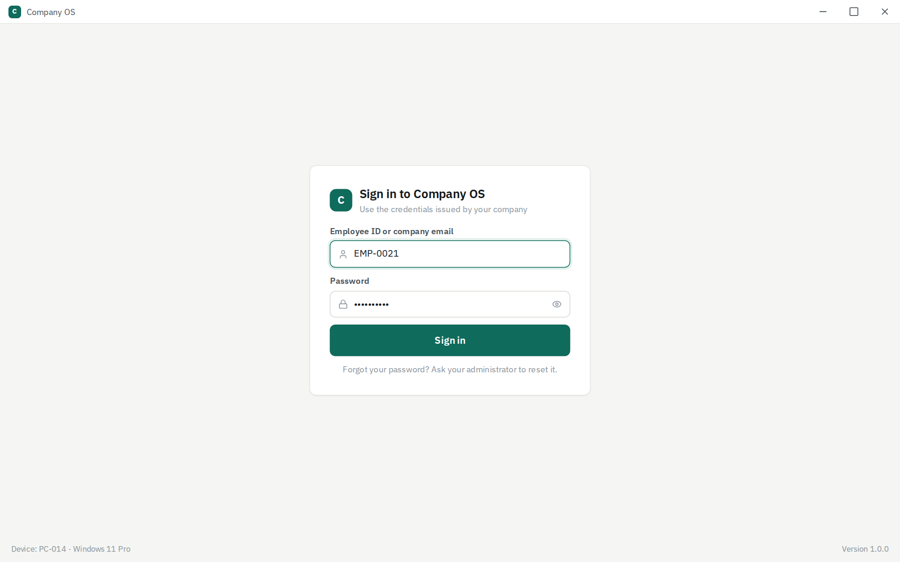

- **Files:** `png/D01-login.png`, `html/D01-login.html`
- **Purpose:** Employee signs in on the desktop app.
- **Elements:** Logo and title; Employee ID or email field; password field with show toggle; Sign in button; help text; footer with device name and app version.
- **Actions:** Sign in -> POST /auth/login. Unknown device -> D02. Temporary password -> D03. No consent -> D04. Else dashboard.
- **States and rules:** Default, loading (button spinner), error banner: wrong credentials, account locked (with minutes), account disabled, no internet.
- **References:** F2, F3, FR-AUTH-01

### D02-device-pending - Device approval pending

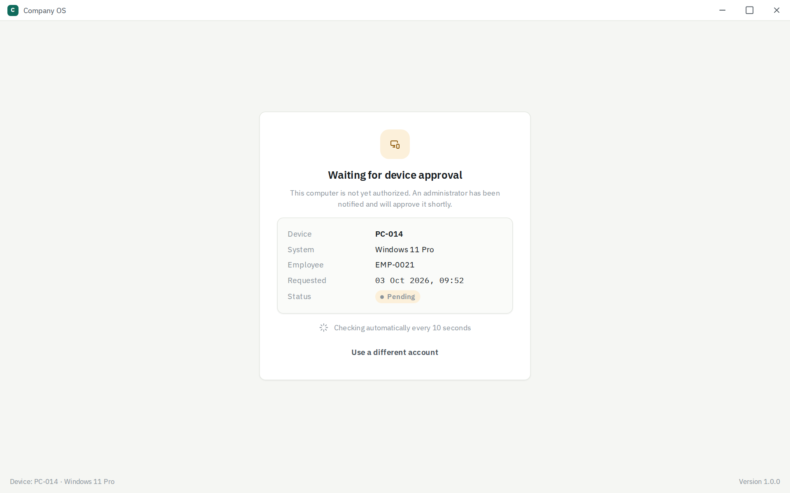

- **Files:** `png/D02-device-pending.png`, `html/D02-device-pending.html`
- **Purpose:** Shown after correct credentials on an unapproved device.
- **Elements:** Icon, title, explanation; device summary card (device, system, employee, requested time, status badge); auto-check hint; link to switch account.
- **Actions:** Polls GET /auth/device-status. On approved -> continue login. On rejected -> show rejected state.
- **States and rules:** Pending, approved (auto continue), rejected (red badge + contact admin), expired.
- **References:** F2, FR-DEV-01

### D03-change-password - Forced password change

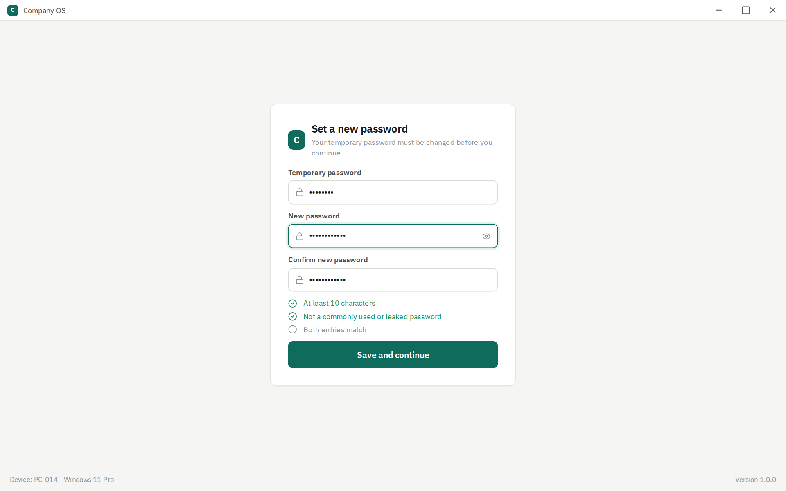

- **Files:** `png/D03-change-password.png`, `html/D03-change-password.html`
- **Purpose:** First login or after an admin reset.
- **Elements:** Three password fields; live rule checklist; Save and continue button.
- **Actions:** Save -> POST /auth/change-password, other sessions revoked, continue to consent or dashboard.
- **States and rules:** Rules unmet (button disabled), error on wrong temporary password.
- **References:** F4, FR-AUTH-06

### D04-consent - Monitoring consent

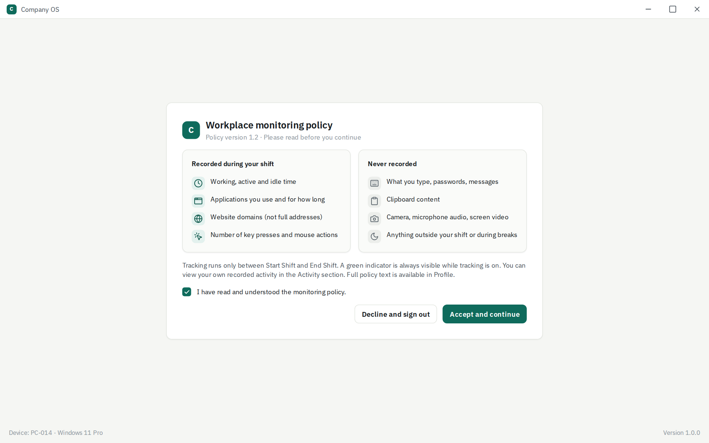

- **Files:** `png/D04-consent.png`, `html/D04-consent.html`
- **Purpose:** Transparency and consent before any tracking can run.
- **Elements:** Policy title and version; two columns: what is recorded, what is never recorded; summary paragraph; confirmation checkbox; Decline and Accept buttons.
- **Actions:** Accept -> POST /auth/consent then dashboard. Decline -> logout.
- **States and rules:** Accept disabled until the checkbox is ticked. Shown again when the policy version changes.
- **References:** F2, 08 section 6

### D05-dashboard-off-shift - Dashboard, off shift

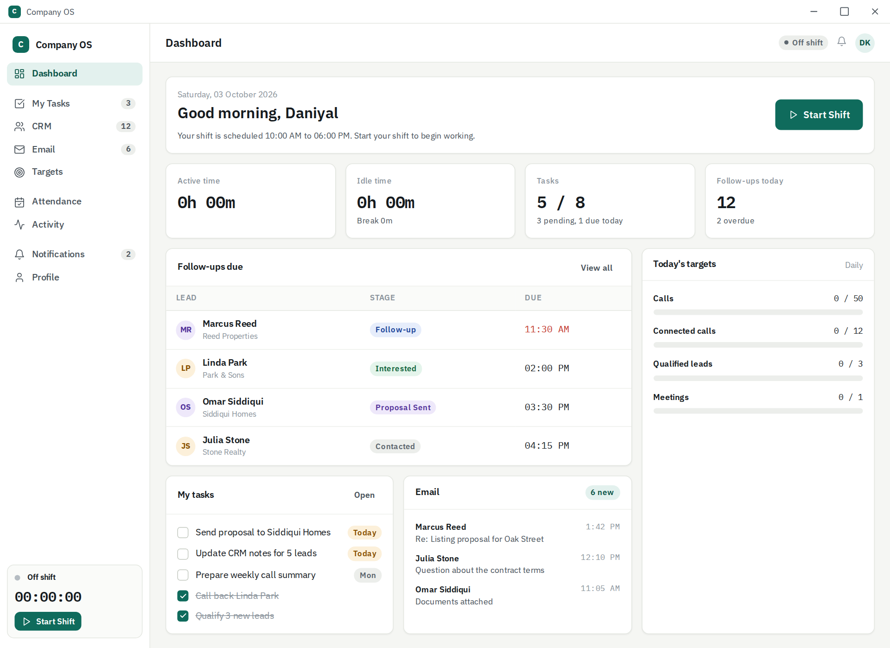

- **Files:** `png/D05-dashboard-off-shift.png`, `html/D05-dashboard-off-shift.html`
- **Purpose:** Landing screen after login when no shift is open.
- **Elements:** Greeting and date; shift card with scheduled hours and a large Start Shift button; four stat cards (active time, idle time and break allowance, tasks, follow-ups); follow-ups due table; my tasks checklist; email preview with new count; today's targets with progress bars. Sidebar bottom: shift box with status dot, timer and shift buttons. Header: tracking badge, notifications, avatar.
- **Actions:** Start Shift -> POST /shifts/events(start), agent starts tracking.
- **States and rules:** Off shift: grey status, zero values. Mandatory update pending: Start Shift blocked with notice.
- **References:** F5, FR-ATT-01

### D06-dashboard-working - Dashboard, working

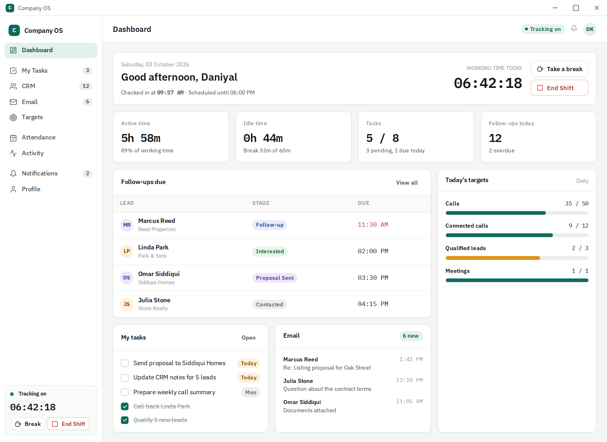

- **Files:** `png/D06-dashboard-working.png`, `html/D06-dashboard-working.html`
- **Purpose:** Main working screen of the employee.
- **Elements:** Greeting and date; shift card with check-in time, live working timer, Break and End Shift buttons; four stat cards (active time, idle time and break allowance, tasks, follow-ups); follow-ups due table; my tasks checklist; email preview with new count; today's targets with progress bars. Sidebar bottom: shift box with status dot, timer and shift buttons. Header: tracking badge, notifications, avatar.
- **Actions:** Take a break -> D08. End Shift -> D10. Rows open the lead, task or mail.
- **States and rules:** Working (green), on break (amber, timer paused, Resume button), offline (see D07).
- **References:** F5, F13, F20

### D07-dashboard-offline - Dashboard, offline

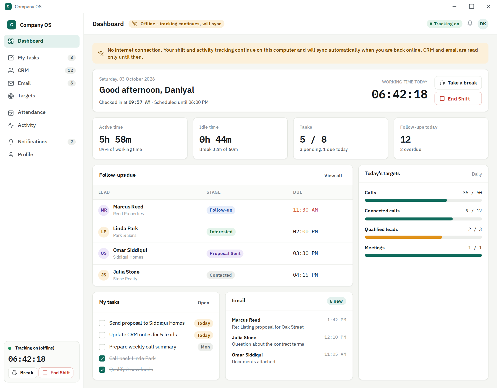

- **Files:** `png/D07-dashboard-offline.png`, `html/D07-dashboard-offline.html`
- **Purpose:** Shows that tracking never stops without internet.
- **Elements:** Greeting and date; shift card with check-in time, live working timer, Break and End Shift buttons; four stat cards (active time, idle time and break allowance, tasks, follow-ups); follow-ups due table; my tasks checklist; email preview with new count; today's targets with progress bars. Sidebar bottom: shift box with status dot, timer and shift buttons. Header: tracking badge, notifications, avatar. Plus: amber offline badge in header and banner at the top.
- **Actions:** Break and End Shift still work (queued). CRM and email write actions disabled.
- **States and rules:** Appears after 60 s without a successful request. Disappears after sync, with a brief 'Synced' toast.
- **References:** F7, FR-TRK-15

### D08-break-dialog - Start break dialog

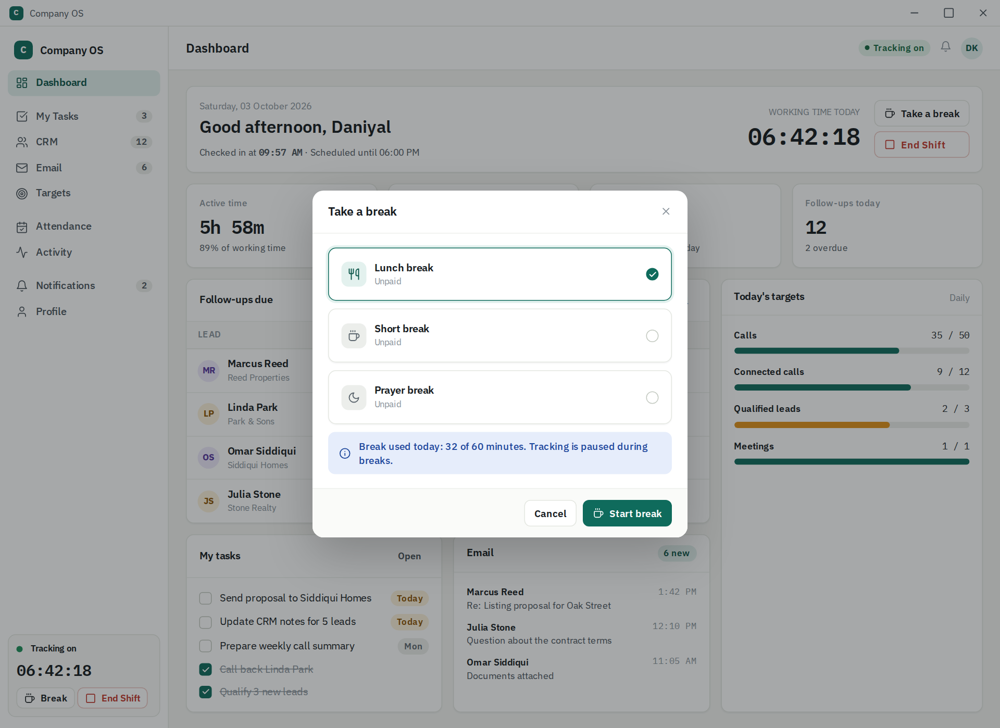

- **Files:** `png/D08-break-dialog.png`, `html/D08-break-dialog.html`
- **Purpose:** Employee selects a break type.
- **Elements:** Modal with selectable break types (radio cards); break allowance info banner; Cancel and Start break buttons.
- **Actions:** Start break -> POST /shifts/events(break_start), agent paused, status amber.
- **States and rules:** Allowance exceeded: banner turns amber with warning.
- **References:** F5, FR-ATT-01

### D09-long-idle-prompt - Long idle prompt

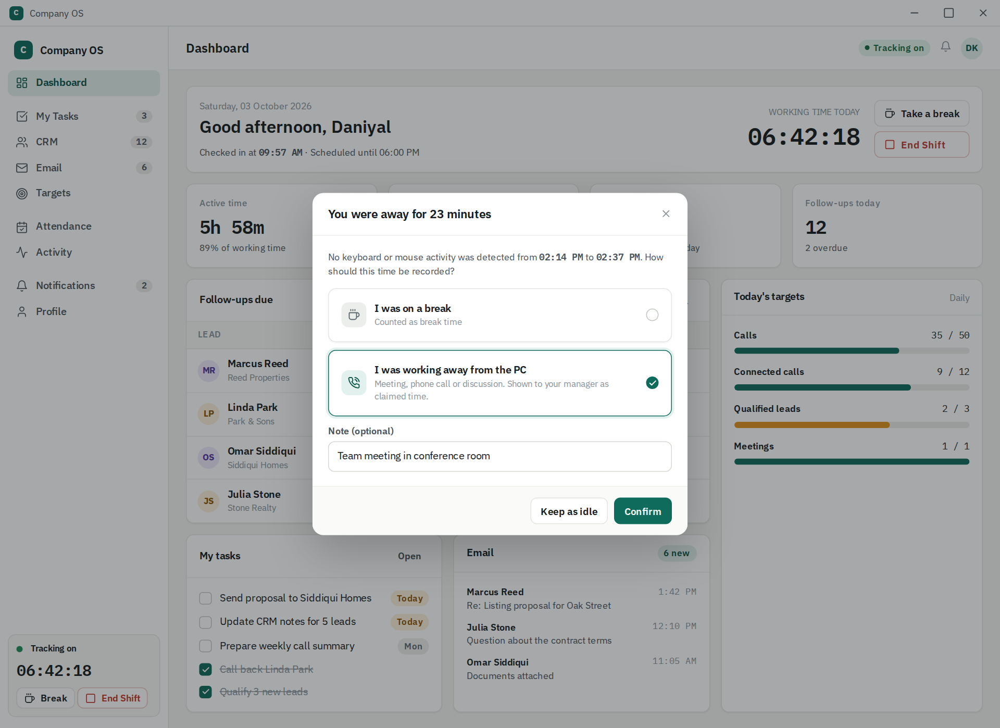

- **Files:** `png/D09-long-idle-prompt.png`, `html/D09-long-idle-prompt.html`
- **Purpose:** Asks the employee to classify an idle period longer than 15 minutes.
- **Elements:** Modal with idle period times; two options (break, working away); optional note; Keep as idle and Confirm buttons.
- **Actions:** Confirm -> stores claim on the idle segments.
- **States and rules:** Only shown when setting long_idle_prompt is on.
- **References:** F5 rule 6, FR-ATT-11

### D10-end-shift-summary - End shift summary

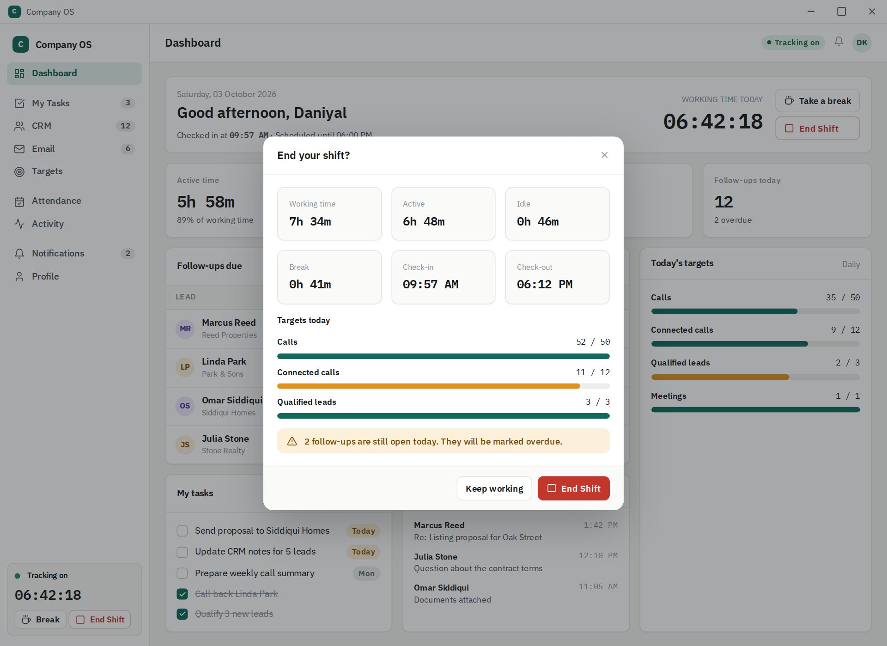

- **Files:** `png/D10-end-shift-summary.png`, `html/D10-end-shift-summary.html`
- **Purpose:** Confirmation with day summary before closing the shift.
- **Elements:** Six summary tiles (working, active, idle, break, check-in, check-out); target results; warning about open follow-ups; Keep working and End Shift buttons.
- **Actions:** End Shift -> POST /shifts/events(end), agent stops, pending update installs.
- **States and rules:** Works offline (queued).
- **References:** F5, F18

### D11-my-tasks - My Tasks

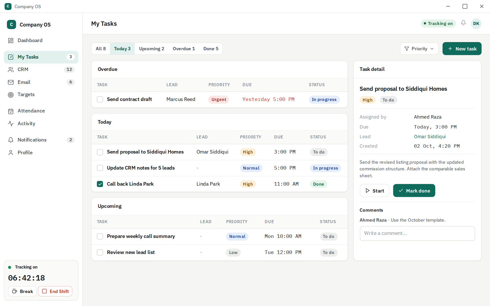

- **Files:** `png/D11-my-tasks.png`, `html/D11-my-tasks.html`
- **Purpose:** Employee's task list with detail panel.
- **Elements:** Filter segments with counts; priority filter; New task button; grouped tables (Overdue, Today, Upcoming) with checkbox, title, lead, priority, due, status; right detail panel with meta, description, actions and comments.
- **Actions:** Checkbox or Mark done -> PATCH /tasks/:id. New task -> create dialog (self-assigned).
- **States and rules:** Empty group hidden. Overdue due time in red.
- **References:** F11, FR-TASK-01..05

### D12-crm-leads - CRM leads list

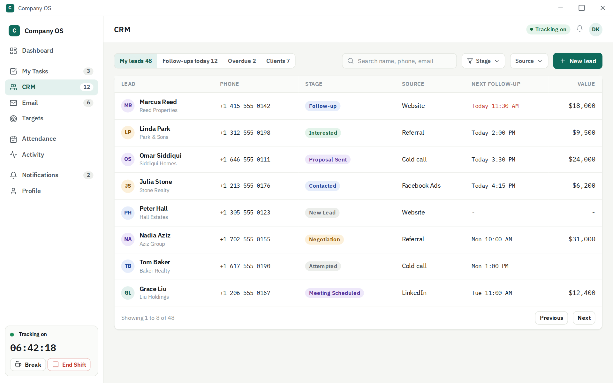

- **Files:** `png/D12-crm-leads.png`, `html/D12-crm-leads.html`
- **Purpose:** Employee sees and works only the leads in their scope.
- **Elements:** Quick view segments (my leads, follow-ups today, overdue, clients); search; stage and source filters; New lead button; table: lead with company, phone, stage badge, source, next follow-up, value; pagination.
- **Actions:** Row click -> D13. New lead -> create form with duplicate check.
- **States and rules:** No export button for employees. Empty state with 'No leads assigned yet'.
- **References:** F10, FR-CRM-01, 03, 09

### D13-lead-detail - Lead detail

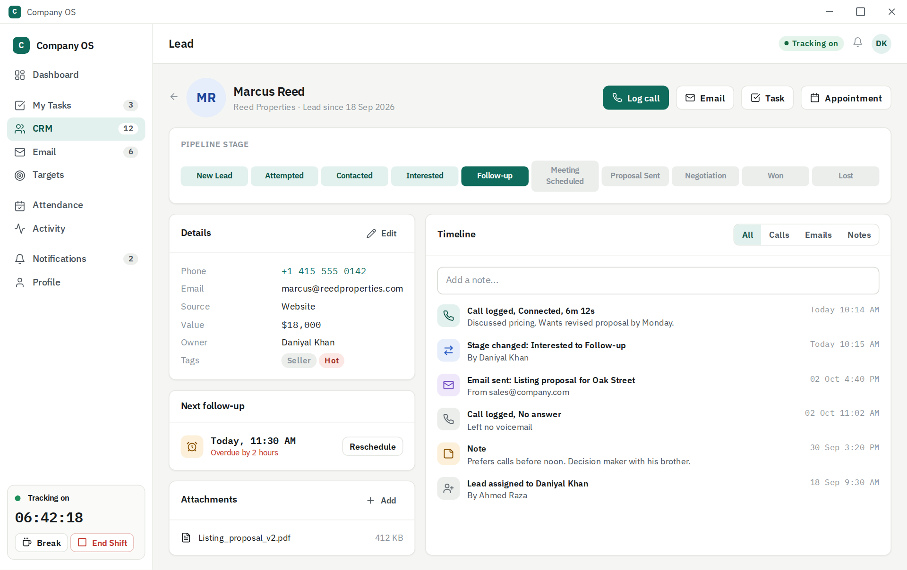

- **Files:** `png/D13-lead-detail.png`, `html/D13-lead-detail.html`
- **Purpose:** Full view of one lead with all actions and history.
- **Elements:** Header: back, avatar, name, company, action buttons (Log call, Email, Task, Appointment); clickable stage stepper with ten stages; details card; next follow-up card with overdue hint; attachments; timeline with note input, type filter and entries (calls, stage changes, emails, notes, assignments).
- **Actions:** Stage click -> POST /leads/:id/stage (Lost asks for reason). Phone click -> tel: link + D14. Add note -> timeline.
- **States and rules:** Do-not-call flag shows red banner and disables Log call.
- **References:** F10, F12, FR-CRM-04..08

### D14-log-call - Log call dialog

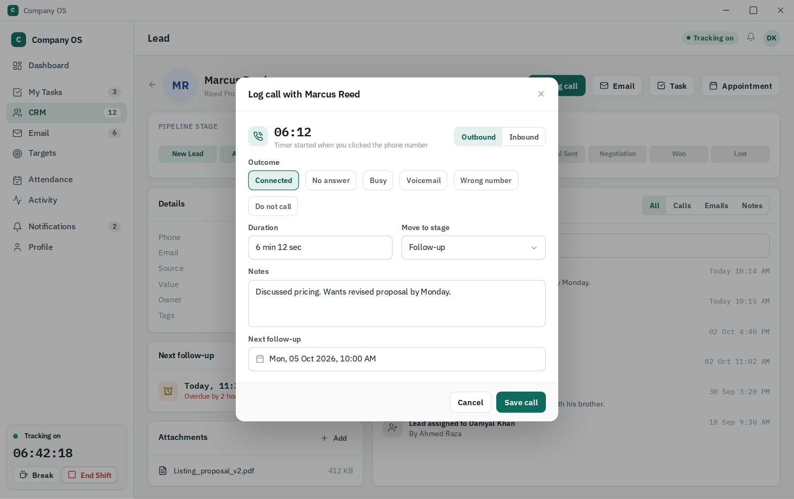

- **Files:** `png/D14-log-call.png`, `html/D14-log-call.html`
- **Purpose:** Records a call. Feeds call targets.
- **Elements:** Running call timer; direction toggle; outcome chips; duration; optional stage change; notes; next follow-up date; Cancel and Save.
- **Actions:** Save -> POST /leads/:id/calls. Creates timeline entry and metric events (calls_total, calls_connected).
- **States and rules:** Outcome required. 'Do not call' shows a confirmation.
- **References:** F12, F13, FR-CRM-06

### D15-email - Email

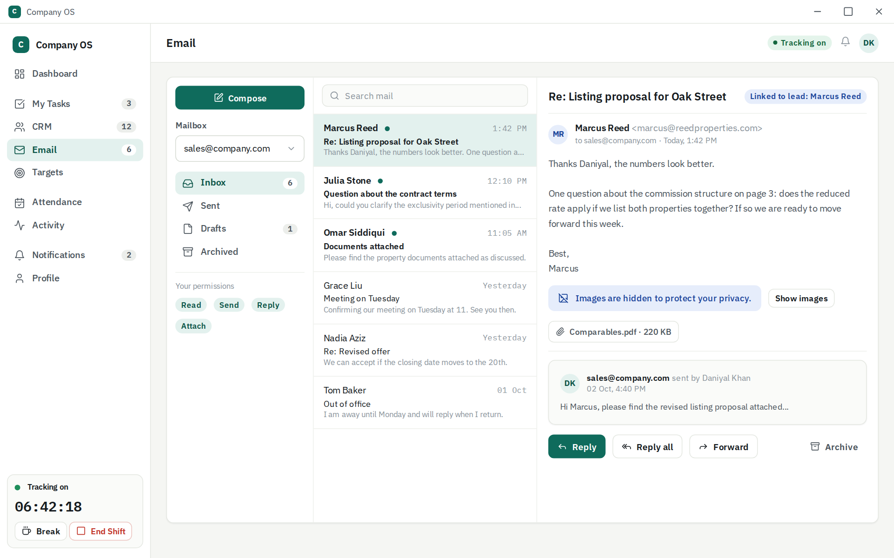

- **Files:** `png/D15-email.png`, `html/D15-email.html`
- **Purpose:** Company mailbox inside the app. The employee never gets a Google login.
- **Elements:** Three panes. Left: Compose, mailbox switcher, folders with counts, own permission badges. Middle: search, thread list with unread dots. Right: subject, lead link badge, message with sender, sanitized body, blocked images notice, attachment chip, previous message showing which employee sent it, Reply, Reply all, Forward, Archive.
- **Actions:** Open thread -> GET thread (audited). Reply -> D16. Buttons hidden when the permission is missing.
- **States and rules:** No delete button exists. Mailbox unavailable state when token is revoked. Read-only when offline.
- **References:** F14, FR-MAIL-03..08

### D16-email-compose - Email compose

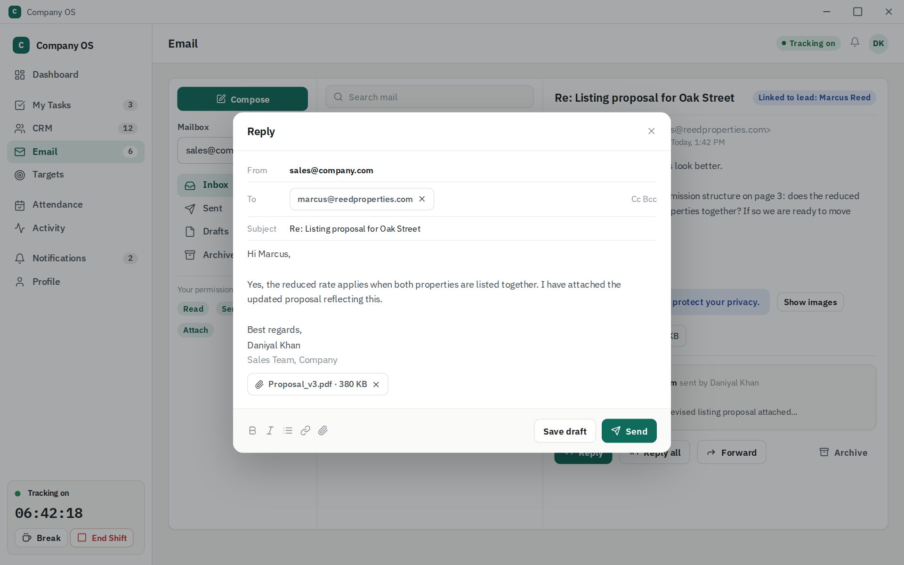

- **Files:** `png/D16-email-compose.png`, `html/D16-email-compose.html`
- **Purpose:** Compose, reply or forward from an assigned mailbox.
- **Elements:** From (fixed mailbox), To with recipient chips, Cc/Bcc, subject, rich text body with signature, attachment chips, formatting toolbar, Save draft, Send.
- **Actions:** Send -> POST /mail/:mailboxId/send. Server checks permission, sends through Gmail, writes audit and lead timeline.
- **States and rules:** Attach hidden without 'attach' permission. Size limit 25 MB error.
- **References:** F14, FR-MAIL-04

### D17-targets - Targets

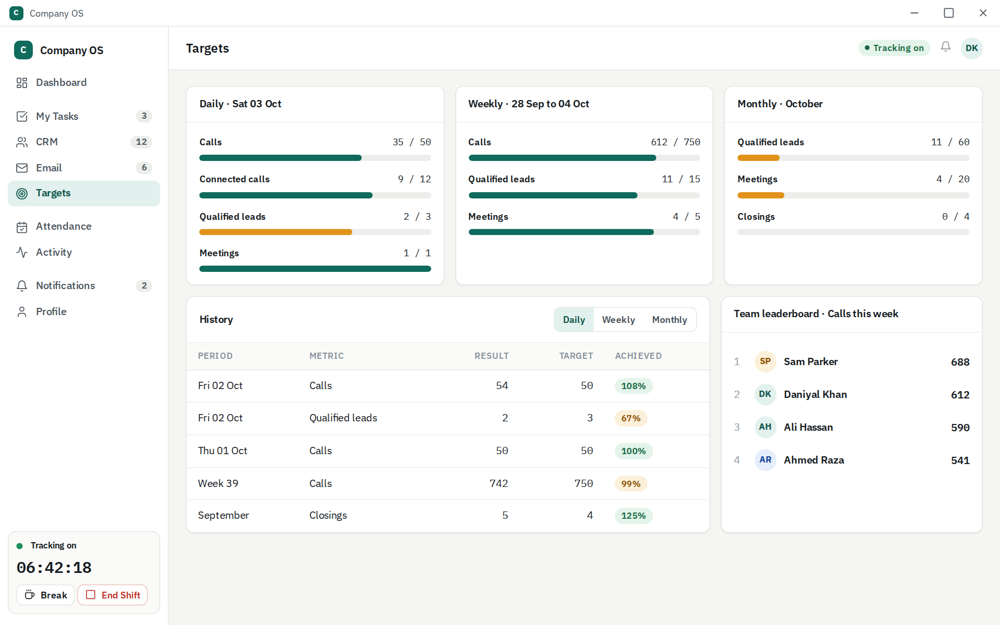

- **Files:** `png/D17-targets.png`, `html/D17-targets.html`
- **Purpose:** Employee's own targets and progress.
- **Elements:** Three cards for daily, weekly and monthly targets with progress bars and values; history table with achievement badges and period switch; team leaderboard.
- **Actions:** Read only. Values update in real time over WebSocket.
- **States and rules:** Not applicable days (leave, holiday) shown greyed. No targets: empty state.
- **References:** F13, FR-TGT-01..06

### D18-attendance - Attendance

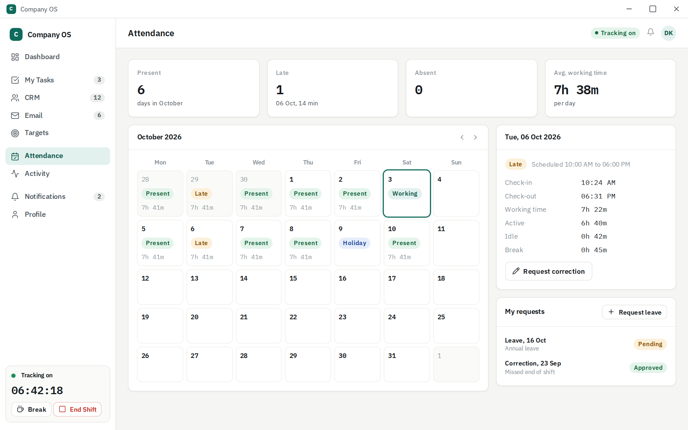

- **Files:** `png/D18-attendance.png`, `html/D18-attendance.html`
- **Purpose:** Employee's own attendance calendar.
- **Elements:** Four month stats; month calendar with status badge and working time per day; selected day detail (schedule, check-in, check-out, working, active, idle, break); Request correction; own requests list with status; Request leave.
- **Actions:** Day click -> detail. Request correction -> D19.
- **States and rules:** Statuses: Present, Late, Half day, Absent, On leave, Holiday, Weekly off, Working (today).
- **References:** F8, F9, FR-ATT-06..09

### D19-correction-request - Attendance correction request

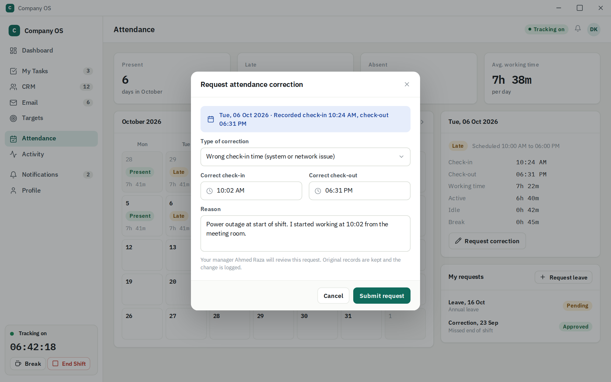

- **Files:** `png/D19-correction-request.png`, `html/D19-correction-request.html`
- **Purpose:** Employee asks for a correction of recorded attendance.
- **Elements:** Recorded values banner; correction type select; corrected check-in and check-out; reason; note on approval and audit; Cancel and Submit.
- **Actions:** Submit -> POST /attendance/corrections. Manager is notified.
- **States and rules:** Reason required.
- **References:** F9, FR-ATT-08

### D20-my-activity - My activity

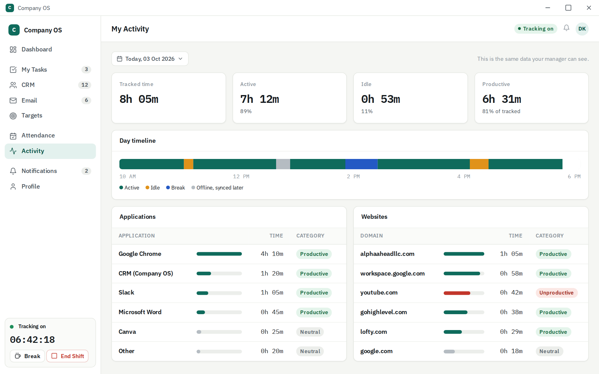

- **Files:** `png/D20-my-activity.png`, `html/D20-my-activity.html`
- **Purpose:** Transparency: employee sees exactly what was recorded about them.
- **Elements:** Date picker; four stats; colour-coded day timeline (active, idle, break, offline); applications table with time bars and category; websites table (domains only).
- **Actions:** Read only. Date change loads another day.
- **States and rules:** Hidden entirely when the company disables own-data view.
- **References:** FR-TRK-13, 08 section 6

### D21-notifications - Notifications

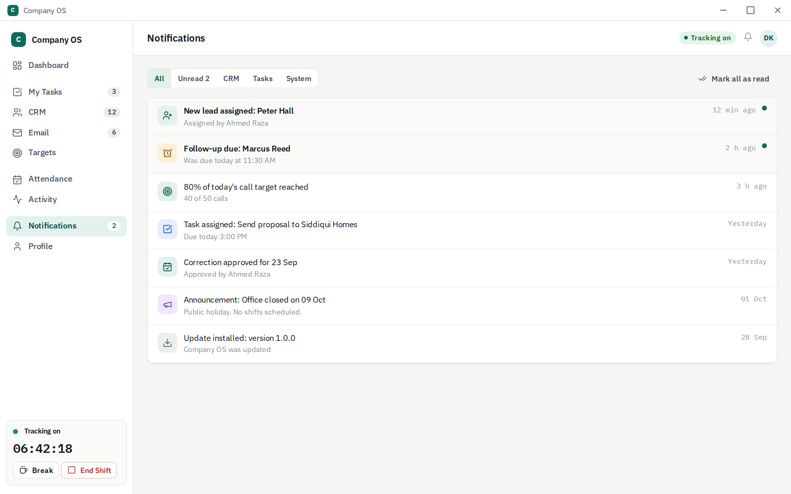

- **Files:** `png/D21-notifications.png`, `html/D21-notifications.html`
- **Purpose:** All notifications of the employee.
- **Elements:** Filter segments; Mark all as read; list with icon, title, detail, time and unread dot.
- **Actions:** Click opens the related lead, task or screen and marks it read.
- **States and rules:** Empty state. Windows toast shown at arrival.
- **References:** F15, FR-NOTIF-01, 02

### D22-profile - Profile

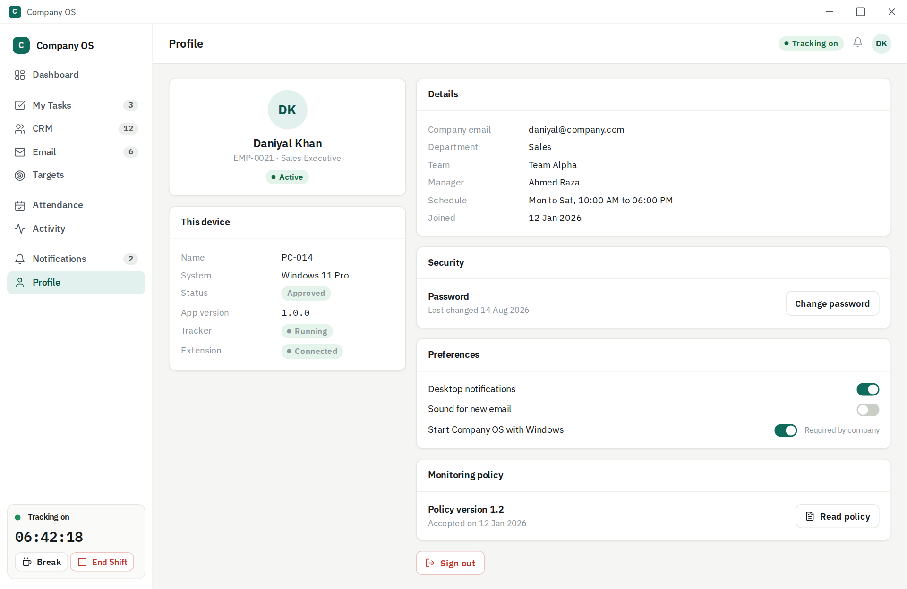

- **Files:** `png/D22-profile.png`, `html/D22-profile.html`
- **Purpose:** Employee profile, device health and preferences.
- **Elements:** Identity card; this device card with tracker and extension status; details (email, department, team, manager, schedule); change password; notification preferences; monitoring policy with accepted version; Sign out.
- **Actions:** Change password -> dialog. Sign out blocked while a shift is open.
- **States and rules:** Tracker or extension problem shown in red with a hint.
- **References:** F3, F4, FR-DEV-05

## Admin Web Panel

### A01-admin-login - Admin login

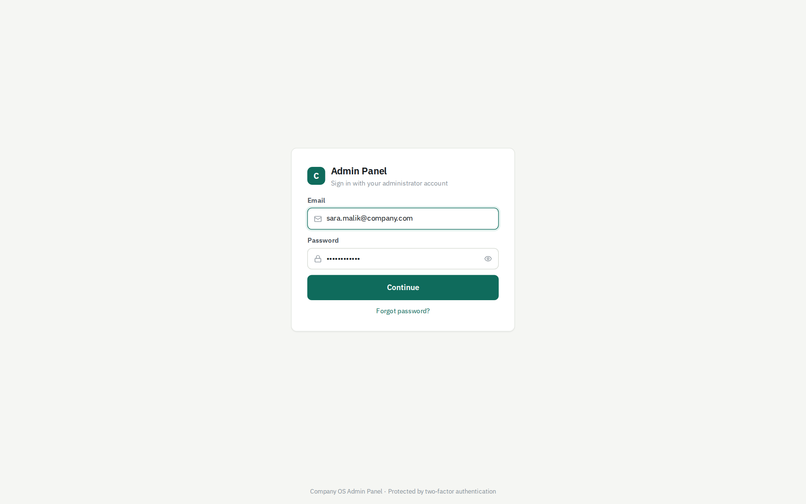

- **Files:** `png/A01-admin-login.png`, `html/A01-admin-login.html`
- **Purpose:** Login for Super Admin, Admin, Manager and Team Leader.
- **Elements:** Email, password, Continue, forgot password link.
- **Actions:** Continue -> POST /admin/auth/login then A02.
- **States and rules:** Error: wrong credentials, locked, IP not allowed.
- **References:** F3, FR-AUTH-07

### A02-admin-2fa - Two-factor verification

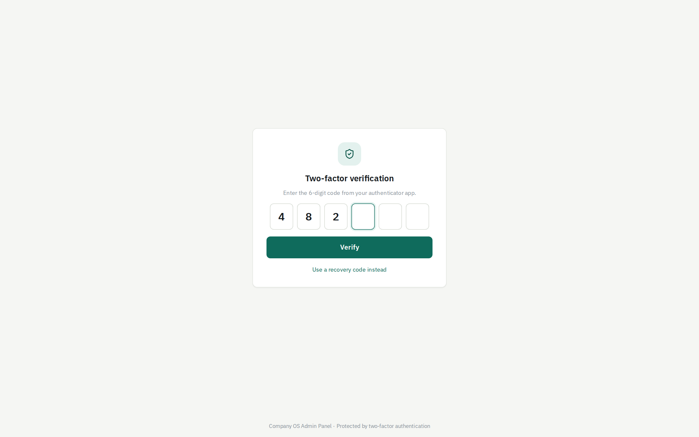

- **Files:** `png/A02-admin-2fa.png`, `html/A02-admin-2fa.html`
- **Purpose:** Mandatory second factor for every Admin Panel user.
- **Elements:** Six code boxes, Verify, recovery code link.
- **Actions:** Verify -> POST /admin/auth/2fa. First login shows QR enrolment instead.
- **States and rules:** Wrong code error, 5 attempts then lockout.
- **References:** FR-AUTH-07

### A03-admin-dashboard - Admin dashboard

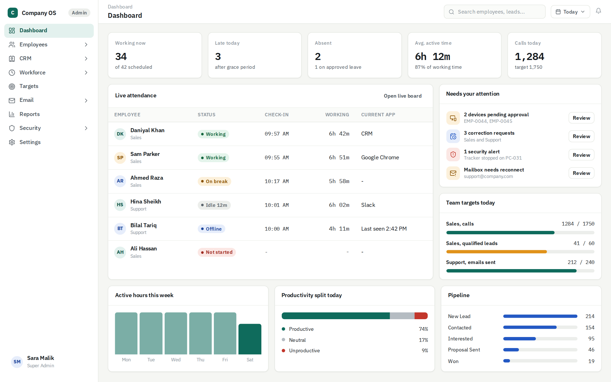

- **Files:** `png/A03-admin-dashboard.png`, `html/A03-admin-dashboard.html`
- **Purpose:** Company overview for managers and admins.
- **Elements:** Five KPI cards; live attendance table (status, check-in, working time, current app); attention list (pending devices, corrections, alerts, mailbox issues) with Review buttons; team targets; active hours bar chart; productivity split; pipeline funnel.
- **Actions:** Review buttons deep-link to the related page. Date chip changes the period.
- **States and rules:** Data limited to the viewer's scope (team, department, all). Live rows update by WebSocket.
- **References:** F19, F20, FR-ATT-07

### A04-employees - Employees list

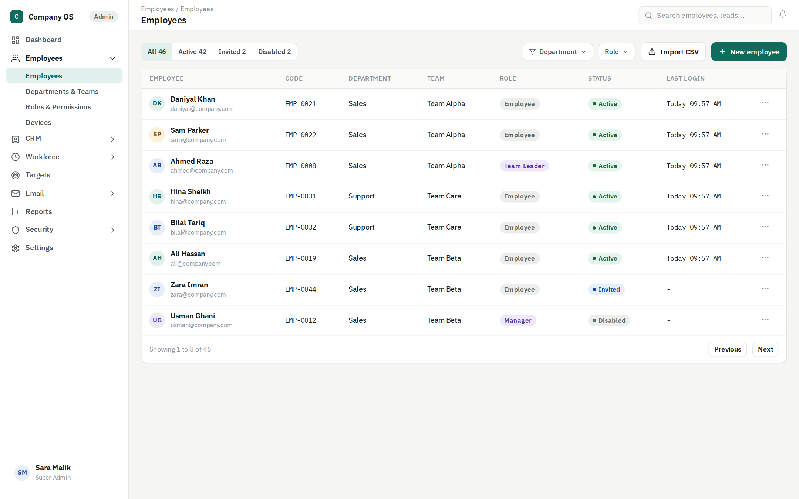

- **Files:** `png/A04-employees.png`, `html/A04-employees.html`
- **Purpose:** Manage all employee accounts.
- **Elements:** Status segments with counts; department and role filters; Import CSV; New employee; table: employee with email, code, department, team, role badge, status, last login, row menu.
- **Actions:** Row -> A06. New employee -> A05. Row menu: reset password, disable.
- **States and rules:** Invited (never logged in), Active, Disabled.
- **References:** F1, FR-ORG-02..06

### A05-new-employee - New employee drawer

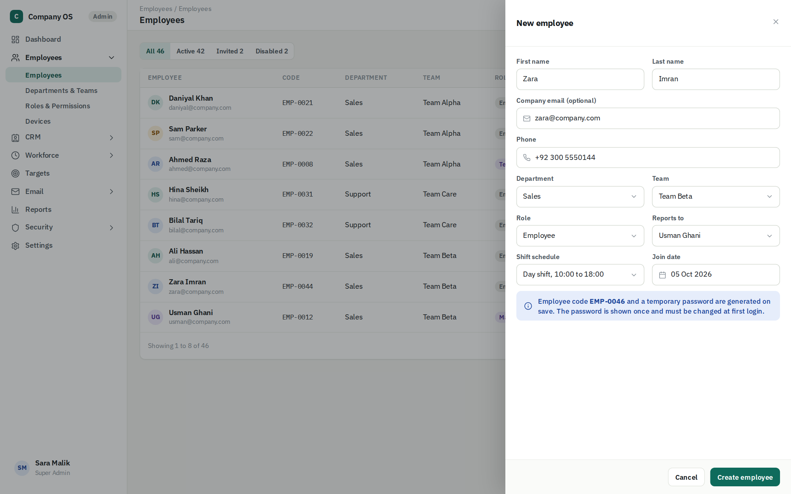

- **Files:** `png/A05-new-employee.png`, `html/A05-new-employee.html`
- **Purpose:** Create an employee account.
- **Elements:** Right drawer form: first and last name, email, phone, department, team, role, manager, schedule, join date; info on generated code and temporary password; Cancel and Create.
- **Actions:** Create -> POST /employees. Then a dialog shows the temporary password once with a copy button.
- **States and rules:** Validation errors inline. Email must be unique.
- **References:** F1, FR-ORG-02

### A06-employee-profile - Employee profile

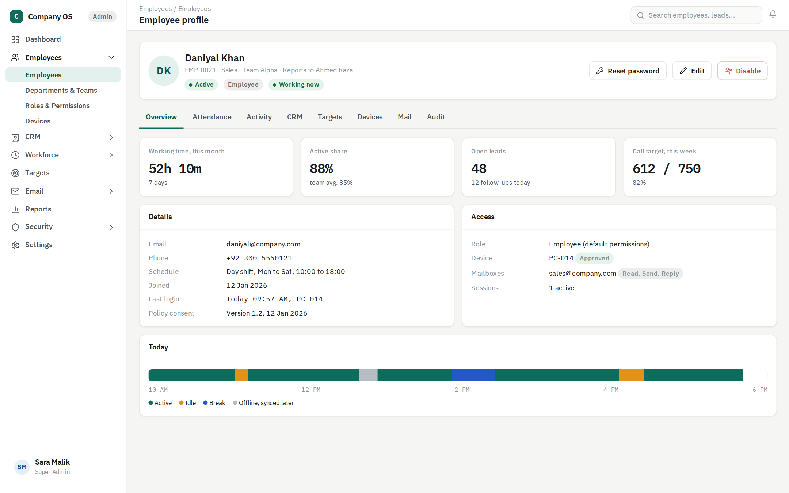

- **Files:** `png/A06-employee-profile.png`, `html/A06-employee-profile.html`
- **Purpose:** Everything about one employee in one place.
- **Elements:** Header: avatar, name, code, org info, status badges, Reset password, Edit, Disable; tabs (Overview, Attendance, Activity, CRM, Targets, Devices, Mail, Audit); KPI cards; details; access summary (role, device, mailboxes, sessions); today's activity timeline.
- **Actions:** Disable -> A07. Tabs load the scoped data for this employee.
- **States and rules:** Tabs hidden when the viewer lacks the permission.
- **References:** FR-ORG-05, F16

### A07-offboarding - Disable employee dialog

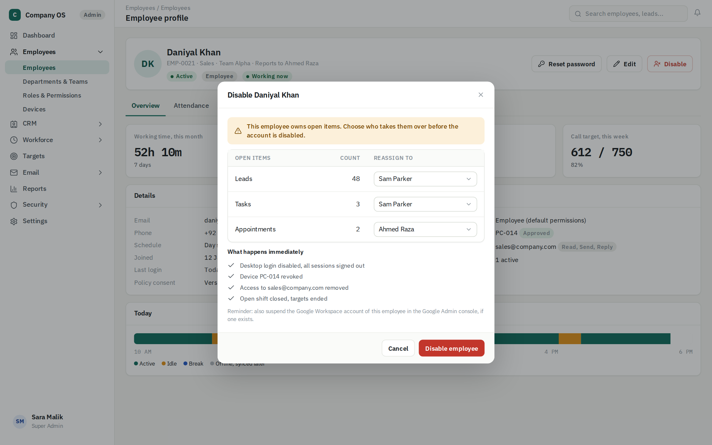

- **Files:** `png/A07-offboarding.png`, `html/A07-offboarding.html`
- **Purpose:** Offboarding in one transaction with mandatory reassignment.
- **Elements:** Warning banner; table of open items with a reassignment select per type; list of immediate effects; Google reminder; Cancel and Disable.
- **Actions:** Disable -> POST /employees/:id/disable with reassignment map.
- **States and rules:** Disable button inactive until every open item type has a new owner.
- **References:** F16, FR-ORG-04

### A08-departments-teams - Departments and teams

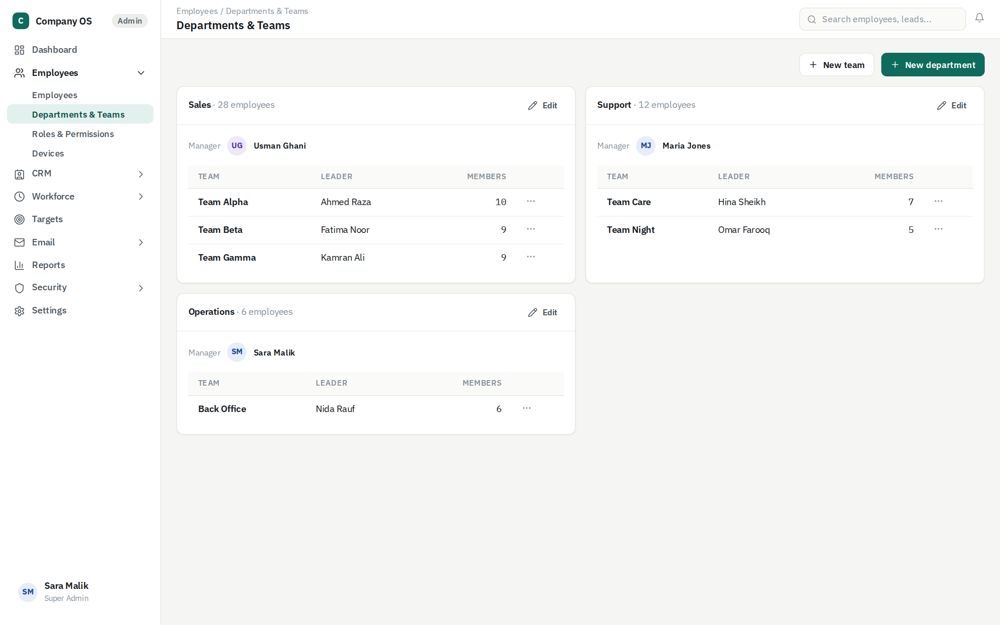

- **Files:** `png/A08-departments-teams.png`, `html/A08-departments-teams.html`
- **Purpose:** Organisation structure that drives permission scopes.
- **Elements:** One card per department: name, employee count, manager, teams table (team, leader, members); New team and New department.
- **Actions:** Edit department or team, change manager or leader.
- **States and rules:** Deleting requires moving members first.
- **References:** FR-ORG-01, 05 scopes

### A09-roles-permissions - Roles and permissions

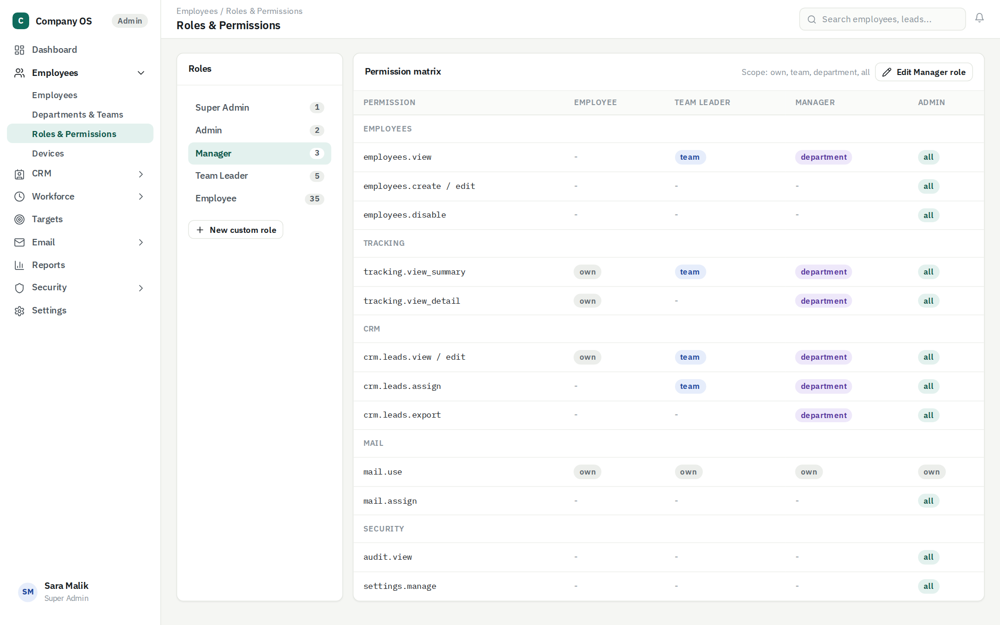

- **Files:** `png/A09-roles-permissions.png`, `html/A09-roles-permissions.html`
- **Purpose:** Define what each role may do and on whose data.
- **Elements:** Role list with member counts and New custom role; matrix grouped by area, one row per permission key, one column per role, cell shows the scope badge (own, team, department, all) or a dash.
- **Actions:** Edit role -> cells become scope selects. Save writes an audit entry.
- **States and rules:** Super Admin is fixed and not editable. Users cannot edit their own role.
- **References:** 05, FR-RBAC-01..05

### A10-devices - Devices

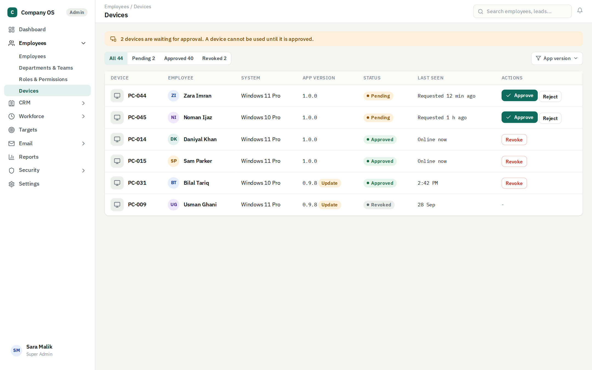

- **Files:** `png/A10-devices.png`, `html/A10-devices.html`
- **Purpose:** Approve, monitor and revoke employee computers.
- **Elements:** Pending banner; status segments; version filter; table: device, employee, system, app version with update badge, status, last seen, actions (Approve, Reject, Revoke).
- **Actions:** Approve -> POST /devices/:id/approve (employee's app continues login). Revoke signs the device out at once.
- **States and rules:** Pending, Approved, Rejected, Revoked.
- **References:** F2, F17, FR-DEV-01..06

### A11-crm-leads - CRM leads, admin

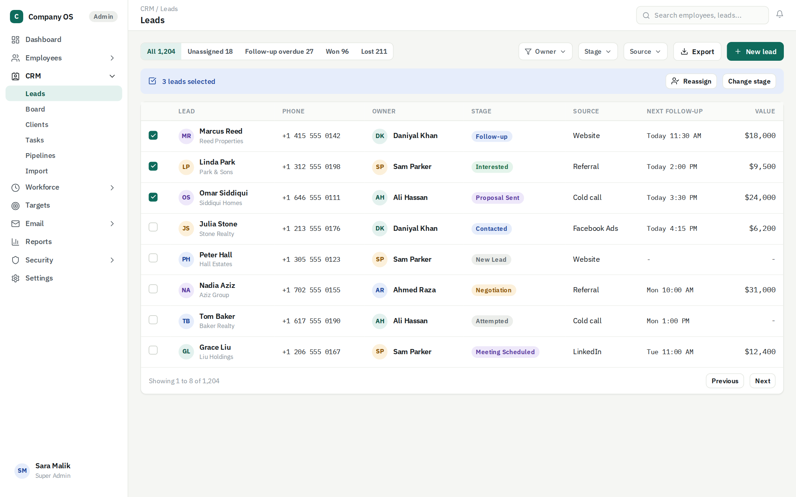

- **Files:** `png/A11-crm-leads.png`, `html/A11-crm-leads.html`
- **Purpose:** All leads within the manager's scope with bulk actions.
- **Elements:** Segments (all, unassigned, overdue, won, lost); owner, stage, source filters; Export (permission); New lead; bulk action bar (Reassign, Change stage); table with checkbox, lead, phone, owner, stage, source, follow-up, value.
- **Actions:** Bulk reassign -> POST /leads/bulk-assign. Export creates an audited job.
- **States and rules:** Export hidden without crm.leads.export.
- **References:** F10, FR-CRM-03, 11, 14

### A12-crm-board - CRM pipeline board

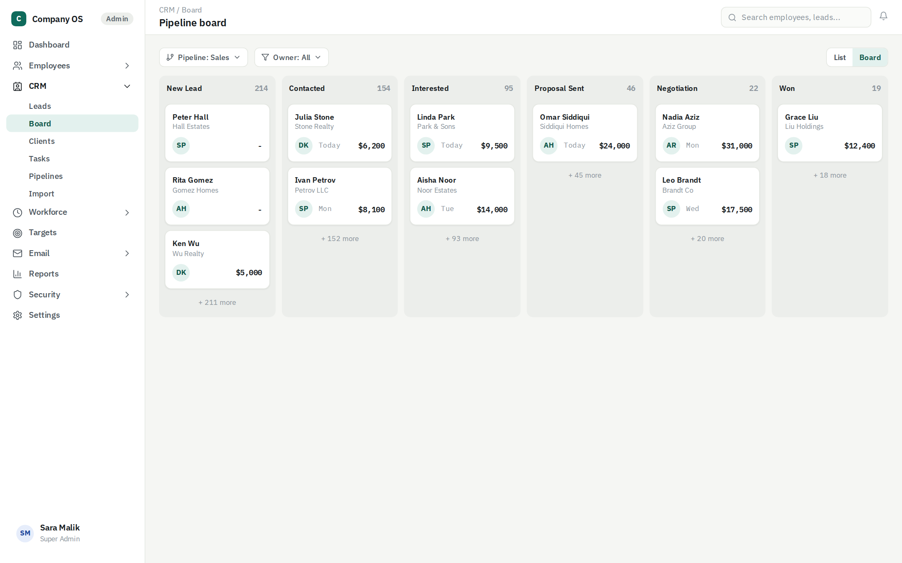

- **Files:** `png/A12-crm-board.png`, `html/A12-crm-board.html`
- **Purpose:** Kanban view of a pipeline.
- **Elements:** Pipeline and owner filters; List/Board switch; one column per stage with count; lead cards (name, company, owner avatar, follow-up, value).
- **Actions:** Drag card to another column -> POST /leads/:id/stage. Card click opens the lead.
- **States and rules:** Moving to Lost opens a reason dialog. Columns scroll vertically.
- **References:** F10, FR-CRM-02, 03

### A13-crm-import - Lead import

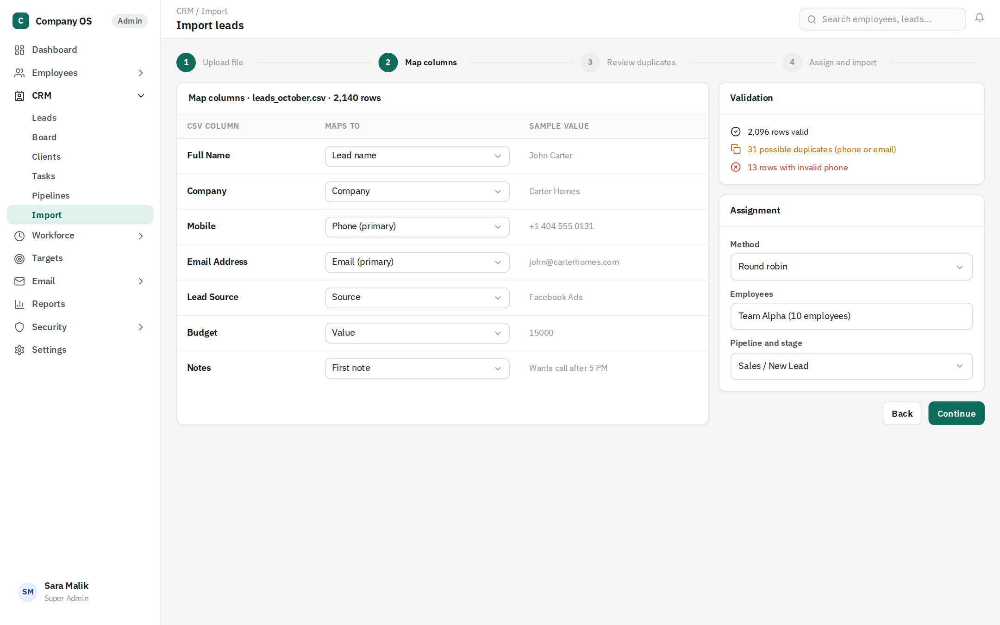

- **Files:** `png/A13-crm-import.png`, `html/A13-crm-import.html`
- **Purpose:** Bulk import of leads from CSV.
- **Elements:** Four-step indicator; column mapping table (CSV column, target field select, sample); validation summary (valid, duplicates, invalid); assignment settings (method, employees, pipeline and stage); Back and Continue.
- **Actions:** Final step starts a background job and shows a result report with a downloadable error file.
- **States and rules:** Duplicates step lets the admin skip, merge or import anyway.
- **References:** F10 rule 7, FR-CRM-09, 10

### A14-tasks - Tasks, admin

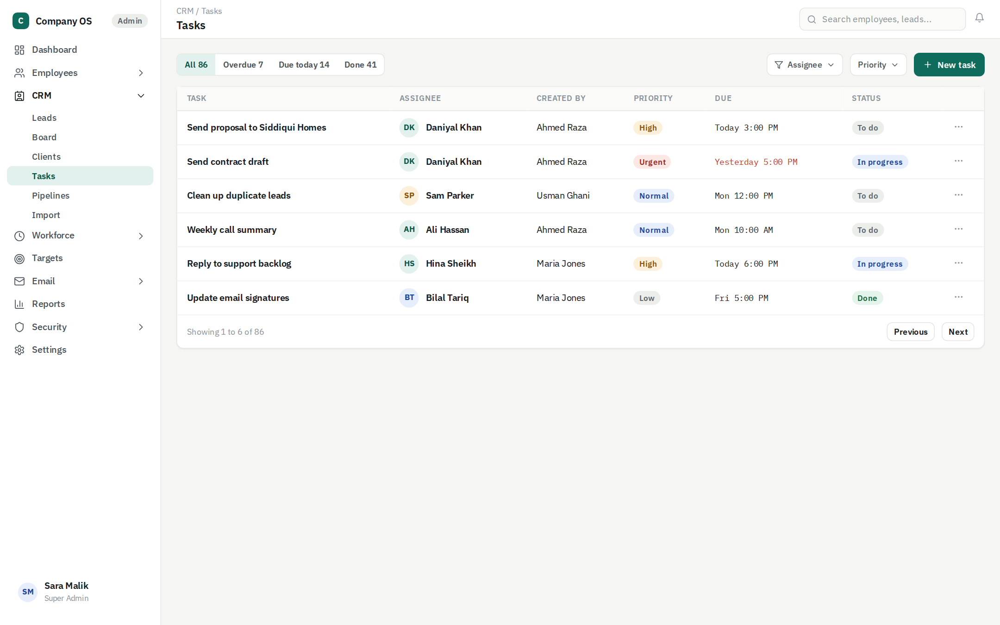

- **Files:** `png/A14-tasks.png`, `html/A14-tasks.html`
- **Purpose:** Assign and follow tasks across the team.
- **Elements:** Segments; assignee and priority filters; New task; table: task, assignee, creator, priority, due (red when overdue), status.
- **Actions:** New task -> form (title, description, assignee, priority, due, lead link).
- **States and rules:** Scope-limited to team or department.
- **References:** F11, FR-TASK-01..03

### A15-pipelines - Pipeline settings

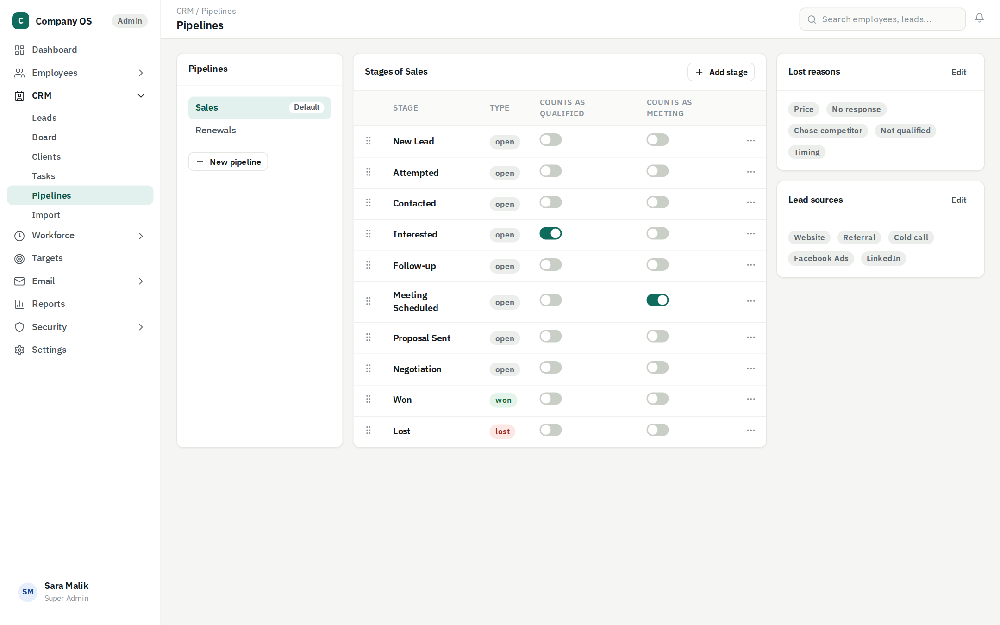

- **Files:** `png/A15-pipelines.png`, `html/A15-pipelines.html`
- **Purpose:** Configure pipelines, stages and lookups.
- **Elements:** Pipeline list; stage table with drag handle, name, type (open, won, lost), toggles for target metrics (qualified, meeting); lost reasons and lead sources.
- **Actions:** Drag to reorder. Toggles define what counts toward targets.
- **States and rules:** A stage in use cannot be deleted, only archived.
- **References:** F10, F13, FR-CRM-02, 12

### A16-live-attendance - Live attendance board

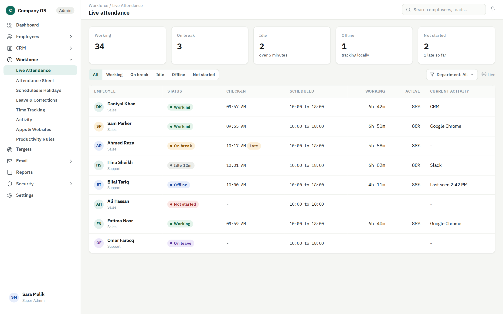

- **Files:** `png/A16-live-attendance.png`, `html/A16-live-attendance.html`
- **Purpose:** Who is working right now.
- **Elements:** Five status counters; status filter; department filter; live indicator; table: employee, live status, check-in with Late badge, schedule, working time, active share, current app or last seen.
- **Actions:** Row click opens the employee's activity for today.
- **States and rules:** Offline means no connection but tracking continues locally; data appears after sync. Statuses: Working, On break, Idle, Offline, Not started, On leave.
- **References:** F5, F7, F8, FR-ATT-07

### A17-attendance-sheet - Monthly attendance sheet

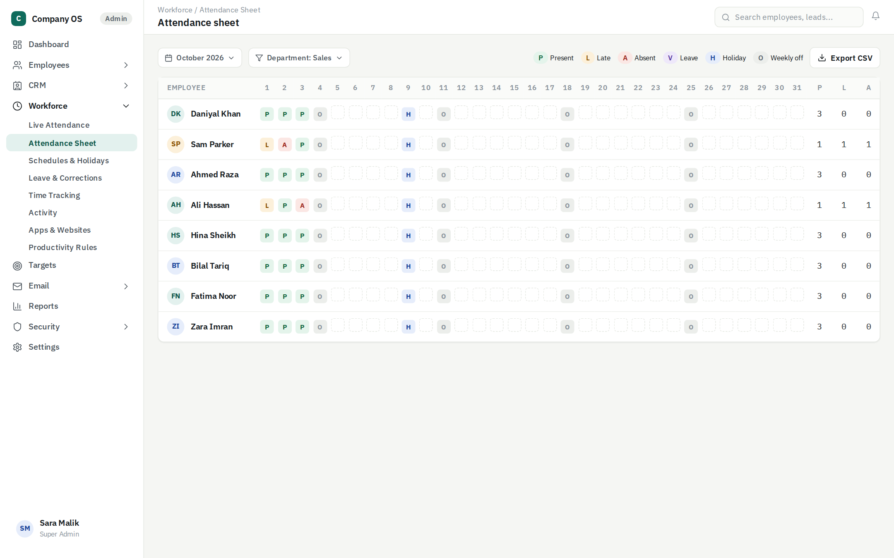

- **Files:** `png/A17-attendance-sheet.png`, `html/A17-attendance-sheet.html`
- **Purpose:** Month grid of attendance statuses.
- **Elements:** Month and department pickers; legend; grid: one row per employee, one cell per day with status letter and colour; totals for present, late, absent; Export CSV.
- **Actions:** Cell click opens the day detail (times, flags, corrections).
- **States and rules:** Future days empty. Corrected days carry a small marker.
- **References:** F8, FR-ATT-06, 10

### A18-schedules-holidays - Schedules and holidays

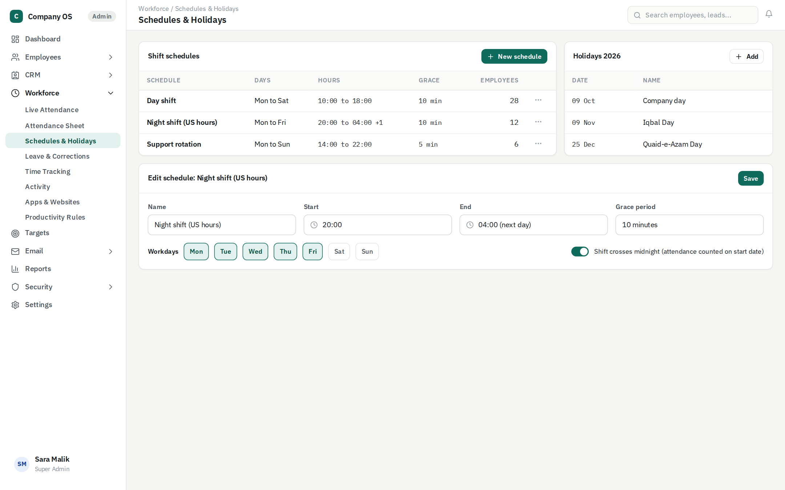

- **Files:** `png/A18-schedules-holidays.png`, `html/A18-schedules-holidays.html`
- **Purpose:** Schedules that attendance rules compare against.
- **Elements:** Schedules table (name, days, hours, grace, employee count); holidays list; schedule editor: name, start, end, grace, workday chips, crosses-midnight toggle.
- **Actions:** Save -> /schedules. Assign to employees from the employee form or in bulk.
- **States and rules:** Night shifts are attributed to the start date.
- **References:** F8, FR-ATT-03..05

### A19-leave-corrections - Leave and corrections

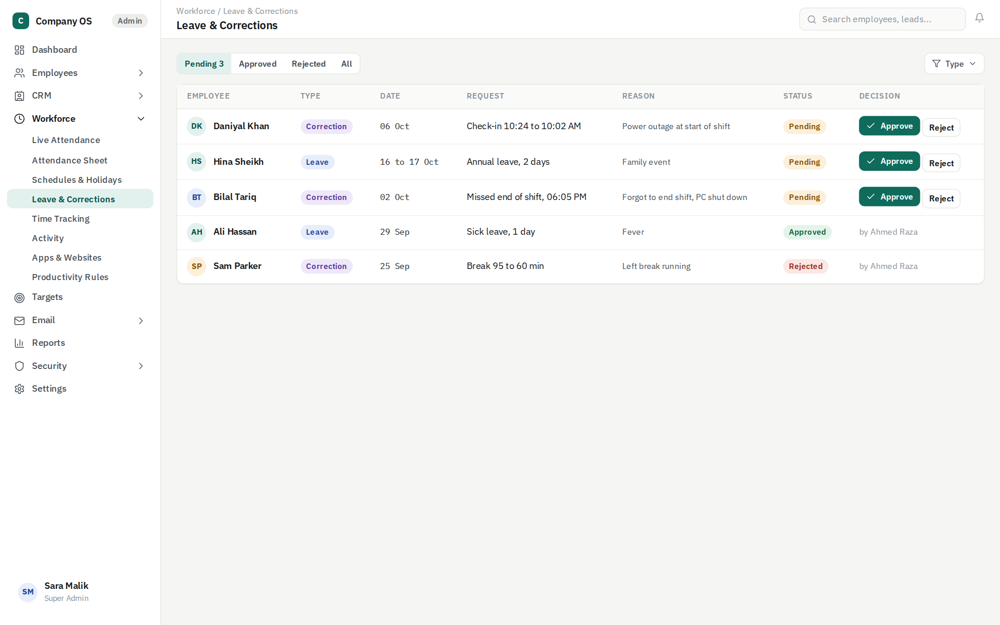

- **Files:** `png/A19-leave-corrections.png`, `html/A19-leave-corrections.html`
- **Purpose:** Managers decide on correction and leave requests.
- **Elements:** Status segments; type filter; table: employee, type, date, requested change, reason, status, Approve and Reject.
- **Actions:** Approve -> adds an adjustment record, recomputes attendance, notifies the employee. Reject asks for a comment.
- **States and rules:** Original tracked data is never edited.
- **References:** F9, FR-ATT-08, 09

### A20-time-tracking - Time tracking report

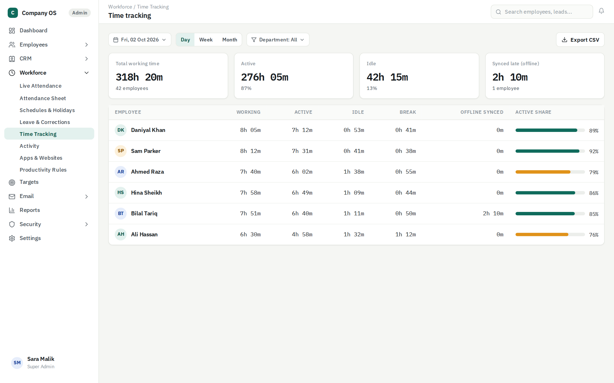

- **Files:** `png/A20-time-tracking.png`, `html/A20-time-tracking.html`
- **Purpose:** Time totals per employee for a period.
- **Elements:** Date and period switch; department filter; Export; four totals; table: working, active, idle, break, offline-synced time and active share bar.
- **Actions:** Row click -> A21 for that employee and day.
- **States and rules:** 'Offline synced' shows time recorded without internet and uploaded later.
- **References:** F6, F7, FR-RPT-02

### A21-activity-drilldown - Employee activity drill-down

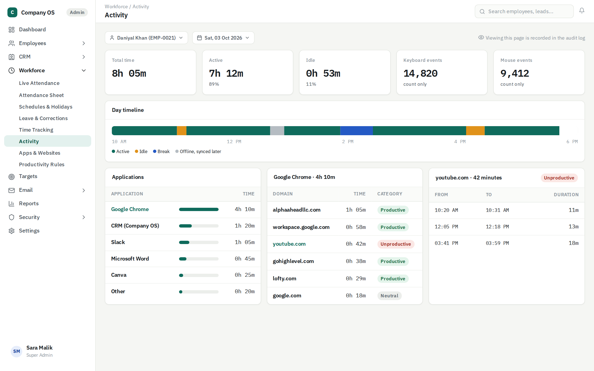

- **Files:** `png/A21-activity-drilldown.png`, `html/A21-activity-drilldown.html`
- **Purpose:** The drill-down from the original concept: day, application, domain, exact time ranges.
- **Elements:** Employee and date pickers; audit notice; five stats including keyboard and mouse counts; colour timeline; three linked panels: applications (click one), domains inside the selected browser, time ranges of the selected domain.
- **Actions:** Click app -> domains. Click domain -> time ranges.
- **States and rules:** Requires tracking.view_detail. Domain 'unknown' for incognito, 'excluded' for excluded sites.
- **References:** F6, F19, FR-TRK-08

### A22-apps-websites - Applications and websites report

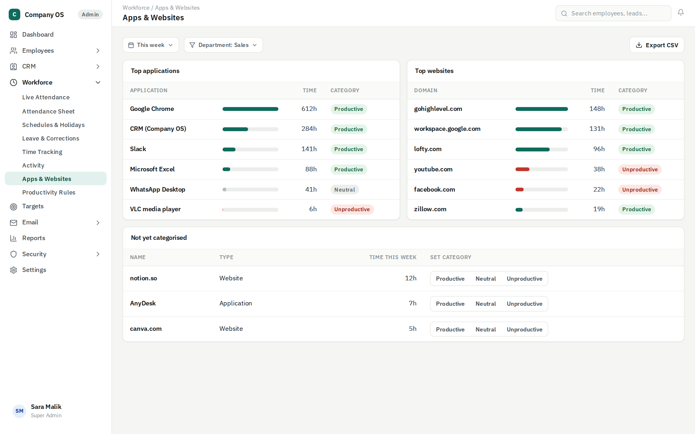

- **Files:** `png/A22-apps-websites.png`, `html/A22-apps-websites.html`
- **Purpose:** Company-wide usage of apps and websites.
- **Elements:** Period and department filters; top applications and top websites with time bars and category; list of uncategorised items with one-click category buttons.
- **Actions:** Set category -> creates a productivity rule.
- **States and rules:** Scope-limited.
- **References:** FR-TRK-07, 09, 10, FR-RPT-03

### A23-productivity-rules - Productivity rules

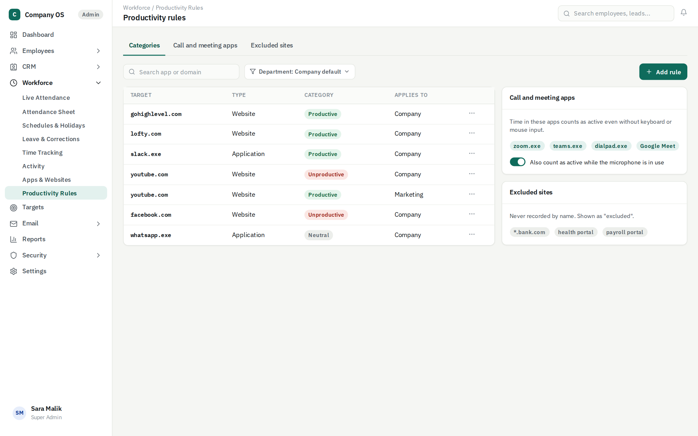

- **Files:** `png/A23-productivity-rules.png`, `html/A23-productivity-rules.html`
- **Purpose:** Rules that classify activity and protect privacy.
- **Elements:** Tabs; search; department scope; rules table (target, type, category, applies to); call and meeting apps card with microphone toggle; excluded sites card.
- **Actions:** Add rule. Department rule overrides the company default.
- **States and rules:** Changes apply to new data and trigger a recompute of today's rollups.
- **References:** FR-TRK-05, 09, 11

### A24-targets - Targets

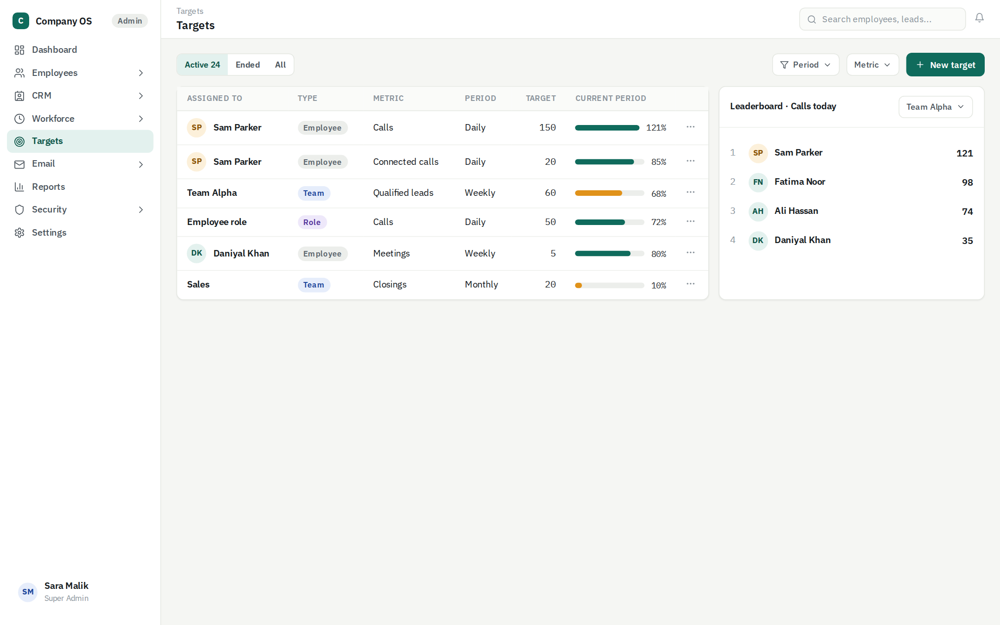

- **Files:** `png/A24-targets.png`, `html/A24-targets.html`
- **Purpose:** Define and monitor targets.
- **Elements:** Segments; period and metric filters; New target; table: assignee (employee, team or role), metric, period, target value, current progress; leaderboard.
- **Actions:** New target -> A25. Row menu: edit, end, history.
- **States and rules:** Progress is computed from events. No manual entry anywhere.
- **References:** F13, FR-TGT-01..06

### A25-new-target - New target dialog

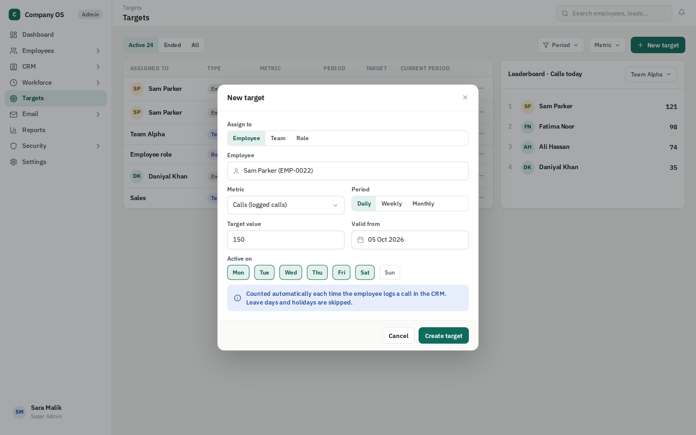

- **Files:** `png/A25-new-target.png`, `html/A25-new-target.html`
- **Purpose:** Create a target for an employee, team or role.
- **Elements:** Assignee type switch and picker; metric select; period switch; target value; valid from; weekday chips (daily only); explanation of how the metric is counted; Cancel and Create.
- **Actions:** Create -> POST /targets.
- **States and rules:** Weekday chips hidden for weekly and monthly.
- **References:** F13, FR-TGT-02

### A26-email-accounts - Email accounts

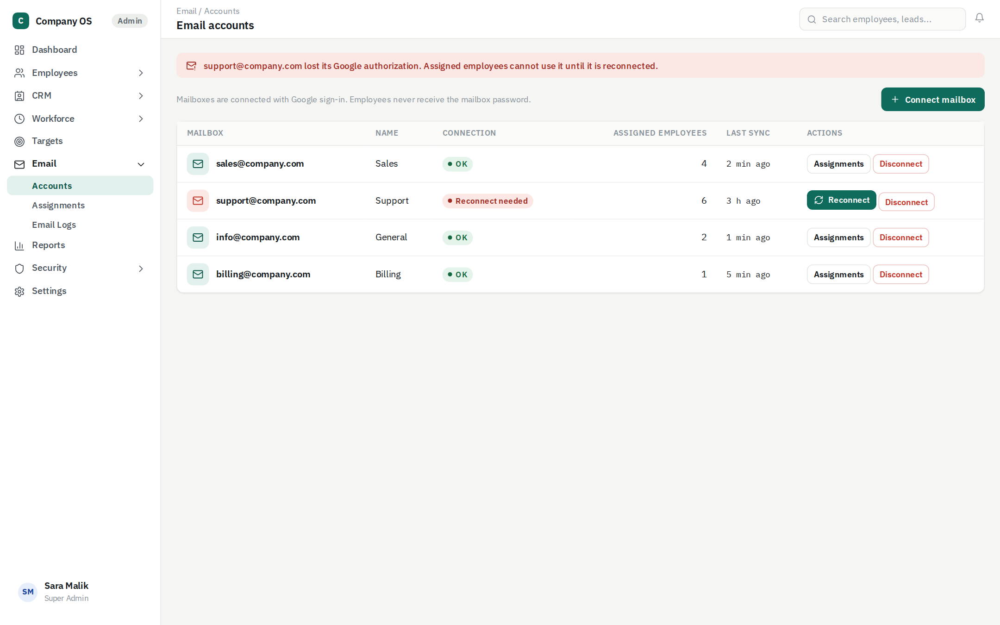

- **Files:** `png/A26-email-accounts.png`, `html/A26-email-accounts.html`
- **Purpose:** Connect Google Workspace mailboxes to the platform.
- **Elements:** Problem banner; explanation; Connect mailbox; table: mailbox, name, connection status, assigned count, last sync, Reconnect or Assignments, Disconnect.
- **Actions:** Connect -> Google sign-in as that mailbox (OAuth). Disconnect revokes the token at Google.
- **States and rules:** Statuses: OK, Reconnect needed, Syncing.
- **References:** F14, 10, FR-MAIL-01, 10

### A27-email-assignments - Mailbox assignments and permissions

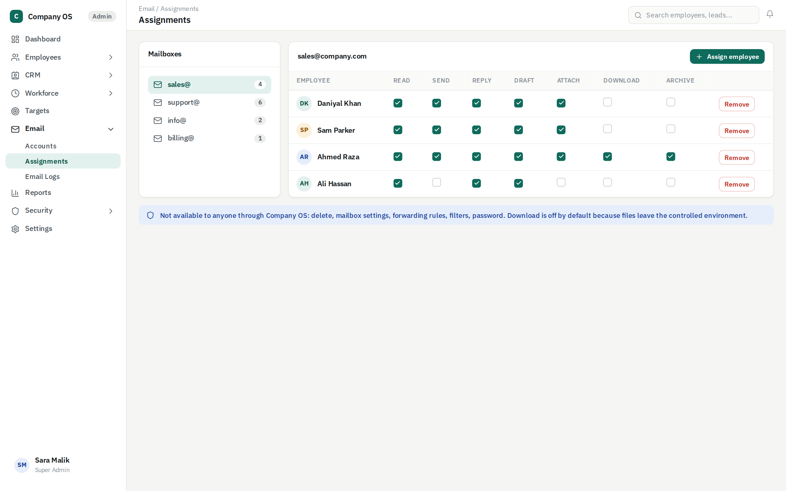

- **Files:** `png/A27-email-assignments.png`, `html/A27-email-assignments.html`
- **Purpose:** Decide who may use a mailbox and what they may do.
- **Elements:** Mailbox list with assigned counts; matrix: one row per employee, checkbox per permission (Read, Send, Reply, Draft, Attach, Download, Archive), Remove; Assign employee; note on functions that never exist.
- **Actions:** Checkbox change -> PATCH assignment, effective on the next request. Remove ends access at once.
- **States and rules:** Enforced by the backend on every mail endpoint.
- **References:** F14, 10 section 5, FR-MAIL-02, 08

### A28-email-logs - Email logs

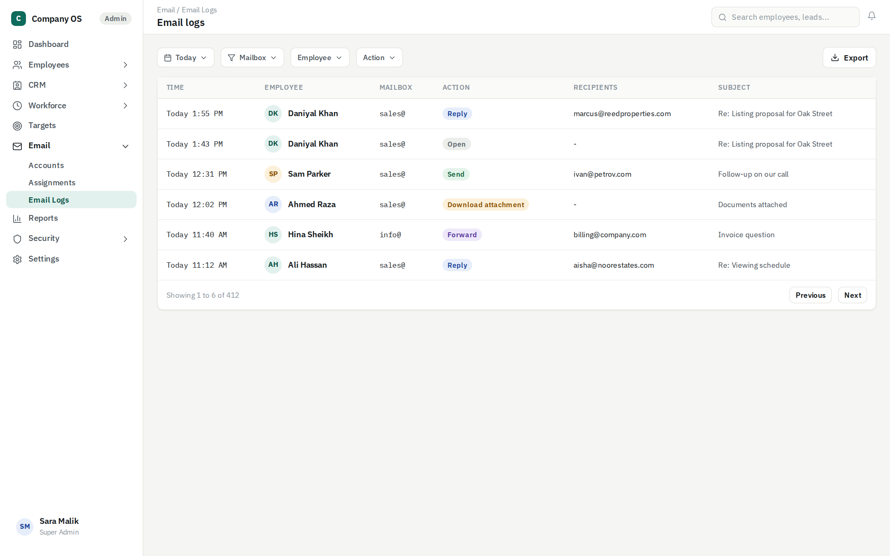

- **Files:** `png/A28-email-logs.png`, `html/A28-email-logs.html`
- **Purpose:** Attribution for shared mailboxes: who did what.
- **Elements:** Date, mailbox, employee and action filters; Export; table: time, employee, mailbox, action (open, send, reply, forward, download), recipients, subject.
- **Actions:** Read only.
- **States and rules:** Mail content is not shown here, only metadata.
- **References:** FR-MAIL-07, 08 section 7

### A29-reports - Reports

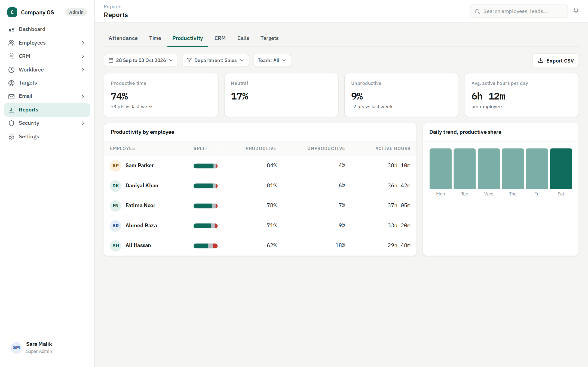

- **Files:** `png/A29-reports.png`, `html/A29-reports.html`
- **Purpose:** Report centre. Shown: productivity report.
- **Elements:** Report tabs (Attendance, Time, Productivity, CRM, Calls, Targets); date range, department and team filters; Export CSV; KPI cards with comparison; per-employee table with stacked split bar; daily trend chart.
- **Actions:** Every tab follows the same layout: filters, KPIs, table, chart. Export is audited.
- **States and rules:** Scope-limited. Empty state for periods without data.
- **References:** FR-RPT-01..08

### A30-login-history - Login history

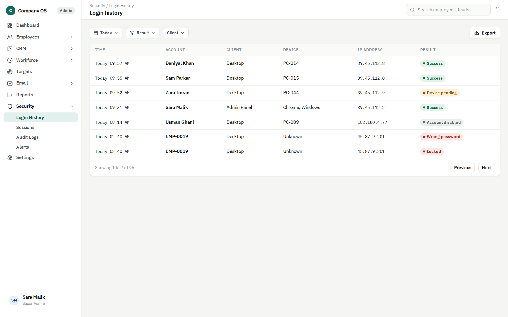

- **Files:** `png/A30-login-history.png`, `html/A30-login-history.html`
- **Purpose:** Every login attempt.
- **Elements:** Date, result and client filters; table: time, account, client (Desktop or Admin Panel), device, IP, result badge.
- **Actions:** Row click shows details. Filter failed attempts to investigate.
- **States and rules:** Results: Success, Wrong password, Locked, Device pending, Device revoked, Account disabled, 2FA failed.
- **References:** FR-AUTH-10, FR-AUD-02

### A31-sessions - Active sessions

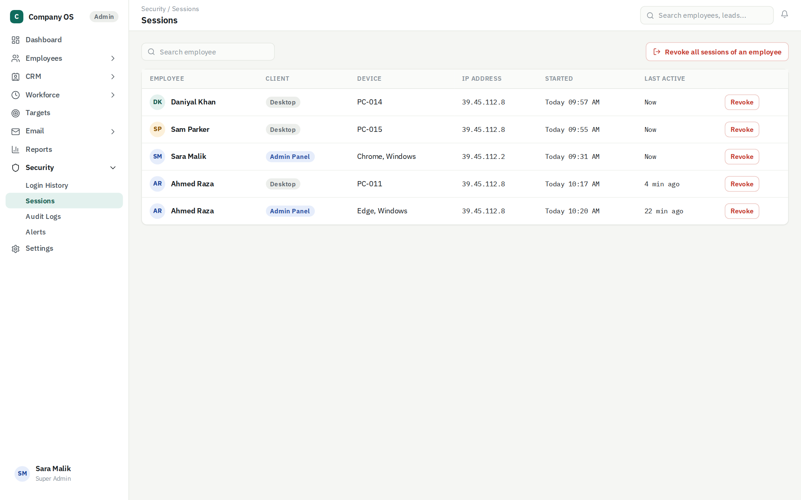

- **Files:** `png/A31-sessions.png`, `html/A31-sessions.html`
- **Purpose:** See and end active sessions.
- **Elements:** Search; bulk revoke; table: employee, client, device, IP, started, last active, Revoke.
- **Actions:** Revoke -> DELETE /sessions/:id. The app receives session.revoked and returns to login.
- **States and rules:** Own current session is marked and cannot be revoked here.
- **References:** F3, FR-AUTH-08

### A32-audit-logs - Audit logs

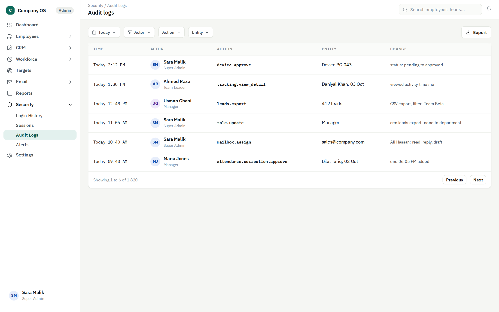

- **Files:** `png/A32-audit-logs.png`, `html/A32-audit-logs.html`
- **Purpose:** Append-only record of every administrative action.
- **Elements:** Date, actor, action and entity filters; Export; table: time, actor with role, action key, entity, change summary.
- **Actions:** Row click opens before and after values, IP and device.
- **States and rules:** Entries cannot be edited or deleted. Viewing employee activity detail is logged too.
- **References:** 08 section 7, FR-AUD-01..03

### A33-security-alerts - Security alerts

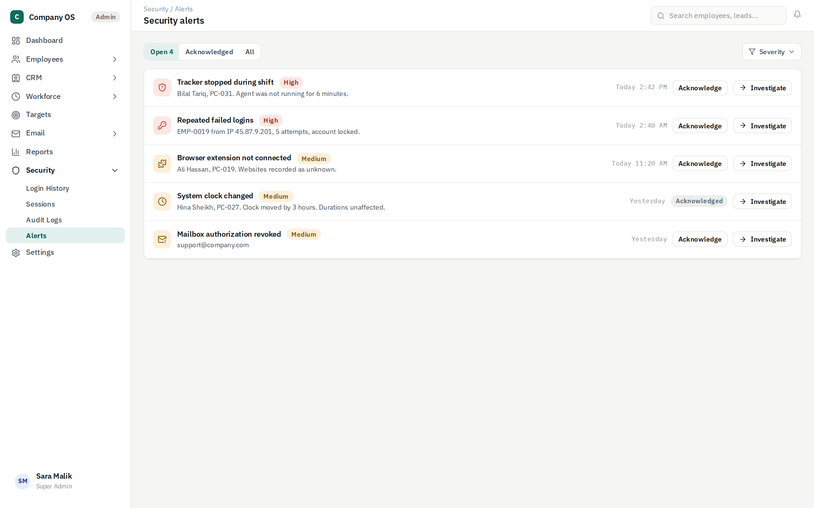

- **Files:** `png/A33-security-alerts.png`, `html/A33-security-alerts.html`
- **Purpose:** Security and tamper signals that need attention.
- **Elements:** Status segments; severity filter; list: icon, title, severity badge, detail, time, Acknowledge, Investigate.
- **Actions:** Investigate deep-links to the device, employee or mailbox. Acknowledge records who handled it.
- **States and rules:** Types: tracker stopped, extension missing, clock changed, failed logins, token reuse, mailbox revoked.
- **References:** 08 section 5, FR-TRK-12, FR-AUD-04

### A34-settings - Settings

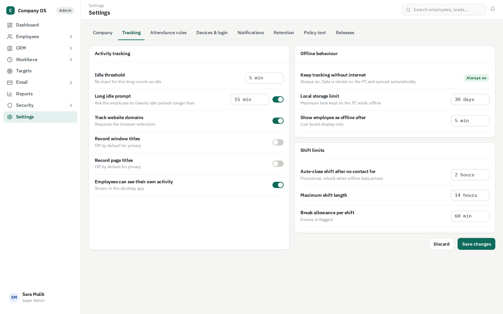

- **Files:** `png/A34-settings.png`, `html/A34-settings.html`
- **Purpose:** Company-wide configuration. Shown: Tracking tab.
- **Elements:** Tabs (Company, Tracking, Attendance rules, Devices and login, Notifications, Retention, Policy text, Releases); setting rows with label, description and control (number input, toggle); cards: activity tracking, offline behaviour, shift limits; Discard and Save.
- **Actions:** Save -> PATCH /settings, pushed to desktop apps as config.updated.
- **States and rules:** Every change is audited. 'Keep tracking without internet' is fixed on.
- **References:** FR-SET, F5, F7

## Screens not drawn separately

These reuse an existing layout. Build them from the named pattern.

| Screen | Build from |
|---|---|
| Desktop: new lead form, new task form, appointment form | Modal pattern of D14 |
| Desktop: on-break dashboard | D06 with amber status, paused timer, Resume button (see sidebar state in lib) |
| Desktop: leave request | Modal pattern of D19 |
| Desktop: device rejected, account locked | D02 and D01 with error state |
| Admin: 2FA enrolment with QR code | A02 card with QR and secret |
| Admin: temporary password dialog after create or reset | Modal with one-time password and copy button |
| Admin: clients list | A11 filtered to won leads |
| Admin: lead detail | D13 layout inside the admin shell, plus owner reassign |
| Admin: new task, new schedule, new pipeline, add rule, assign mailbox | Modal pattern of A25 |
| Admin: reports tabs Attendance, Time, CRM, Calls, Targets | Layout of A29 |
| Admin: settings tabs other than Tracking | Row pattern of A34 |
| Admin: audit entry detail | Right drawer pattern of A05 with before and after values |
| Both: empty, loading (skeleton rows) and error states | Table and card patterns, see DESIGN-SYSTEM.md |
